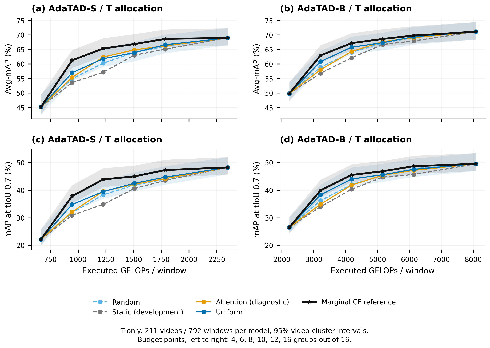

# WTR / BMCR-T / AdaTAD：代码、绘图与实验记录

本页汇总 **2026-09-15 的科研快照**：完整 Core、Raw-v1、Atlas 源码分支，设计与交叉审阅记录，已有科研绘图，以及 4090、A100、AutoDL 三端的原始实验记录。各课程仍保留自己的科学版本；本次发布没有改动训练或模型实现。

| 内容 | 入口 |
|---|---|
| 完整日志、逐窗口测量、预测结果、部署回执 | [Release 下载](https://github.com/yuzbo/BMCR-T-AdaTAD/releases/tag/wtr-snapshot-20260915) · [分卷索引与快照时间](publication/20260915/RECORDS.md) |
| 代码模型、实验发现、结论边界 | [详细报告](publication/20260915/reports/wtr_fasttrack_20260915/current_model_report/MODEL_AND_EVIDENCE.zh.md) |
| 当前生效计划与完整用户设计原文 | [实验计划](publication/20260915/reports/wtr_fasttrack_20260915/EXPERIMENT_PLAN.zh.md) · [设计原文](publication/20260915/reports/wtr_fasttrack_20260915/inputs) |
| 逐实验审阅、修复与科学准入 | [审阅状态](publication/20260915/reports/wtr_fasttrack_20260915/REVIEW_STATUS.zh.md) · [交叉审核全文](publication/20260915/reports/wtr_code_review_20260915_578bab2/REVIEW.zh.md) · [最终模型台账](publication/20260915/reports/wtr_fasttrack_20260915/FINAL_MODEL_LEDGER.csv) |
| 最新已完成的 T 分配图与数值表 | [PNG / SVG / 报告 / 成本账本](publication/20260915/figures/temporal) |
| 历轮方案、实施记录与讨论 | [完整本地报告副本](publication/20260915/reports) · [Atlas 协议与讨论](publication/20260915/atlas/research/atlas_20260915) · [旧参考模型补充讨论](publication/20260915/historical_updates) |
| 文件来源与版本对应关系 | [发布清单](publication/20260915/manifest.json) · [原入口归档](publication/20260915/README_before_publication.md) |
| 一次下载三条完整源码分支与历史 | [Git bundle](https://github.com/yuzbo/BMCR-T-AdaTAD/releases/download/wtr-snapshot-20260915/wtr-core-raw-atlas-source.bundle) · [恢复说明](publication/20260915/RECORDS.md) |
| 本次发布入口的独立复核 | [发布复核记录](publication/20260915/PUBLICATION_REVIEW.zh.md) |

## 完整源码与版本

三个分支独立保留，下载或运行时选择对应分支。本发布分支根目录使用 Core `6e2fc7f` 的代码，并新增文档、图和回执；Raw、Atlas 的较新独立修改在下表对应分支中。

| 源码 | 精确版本 | 对应实现 |
|---|---|---|
| [Core Fast-Track](https://github.com/yuzbo/BMCR-T-AdaTAD/tree/codex/wtr-fasttrack) | [`6e2fc7f`](https://github.com/yuzbo/BMCR-T-AdaTAD/commit/6e2fc7f78424e2485e8d33b079fac926eb0cf4a6) | D/S/T Value、真实交换监督、80 轮课程、断点恢复与内联评测 |
| [Raw-v1](https://github.com/yuzbo/BMCR-T-AdaTAD/tree/codex/wtr-raw-v1) | [`27d557e`](https://github.com/yuzbo/BMCR-T-AdaTAD/commit/27d557ee3bd38a52aec8caaf16860a95957b44b6) | 真实帧读取、Episode/候选合同、冻结桥、CF bank 与 Value fit 入口 |
| [Atlas](https://github.com/yuzbo/BMCR-T-AdaTAD/tree/codex/wtr-characterization-20260915) | [`df2b168`](https://github.com/yuzbo/BMCR-T-AdaTAD/commit/df2b168ff109dda8838ef38bf5dbee048d14c70b) | 全量反事实测量、统计分析、视频级 bootstrap、绘图与成本账本 |

Core 科学模型和训练版本仍为 [`4055294`](https://github.com/yuzbo/BMCR-T-AdaTAD/commit/40552945ad5d56b7404f833cd86f998e8558e8b1)；`6e2fc7f` 只修复评测日志 Tensor 序列化并记录独立 evaluator revision。Atlas 实测版本为 `a50b84d`，后续分析、绘图和文档版本另记，不能把最新文档提交回填到历史运行。

```bash
git clone --branch codex/wtr-publication-20260915 https://github.com/yuzbo/BMCR-T-AdaTAD.git
cd BMCR-T-AdaTAD
# 运行 Raw 或 Atlas 时分别切换对应源码分支：
git switch codex/wtr-raw-v1
# git switch codex/wtr-characterization-20260915
```

运行环境、资产来源和实际启动参数保存在对应源码协议及 Release 中的 resources、plan、Slurm 脚本、metadata 中；[Atlas 资源与冻结排序配置](publication/20260915/atlas/runtime)另有可浏览副本。远端资源路径需要替换成复现机器的实际路径。模型 checkpoint、官方大权重、视频数据、密钥和本地依赖目录不随本次发布上传。

## 已有绘图及其解释

以下图仅覆盖冻结 AdaTAD-S/B 的完整 T 分配测量：每模型 211 视频、792 窗口，六档预算，10,000 次配对视频 bootstrap。CF 是使用 GT 和额外查询的有限候选参考；额外排序成本单列在 [cost_ledger.json](publication/20260915/figures/temporal/cost_ledger.json)，不等同于已训练路由器的部署收益。




8 组预算下，S 的 CF−Uniform 为 **+3.507 pp [2.337, 4.692]**；B 为 **+1.392 pp [−0.058, 2.594]**。区间为逐点区间。完整数值、计费口径及图注见 [图表报告](publication/20260915/figures/temporal/report.md)。

重建这两张图时，切换 Atlas 分支并将 Release 的 Atlas 各分卷解压到同一目录，然后使用该目录中的 `atlas/analysis` 与 `atlas/results`：

```bash
python tools/atlas_temporal_plot.py \
  --analysis /path/to/snapshot/atlas/analysis/temporal_only.json \
  --raw /path/to/snapshot/atlas/results \
  --output output/temporal_reproduced
```

## 当前证据边界

截至随包报告的采集时点，Core D-V/D-U 已完成前 10 轮、1,000 次更新，评测日志修复后的续跑与 S 课程仍在排队；尚无新 Core 完整 mAP。Raw 六视频 19 窗口一致性、24 视频 346 次 swap 和诊断已完成，replay error 为 0，但 Value 尚未拟合，域扩展和学习收益 gate 未通过。Atlas 的 T 全量结果支持研究该方向；D/S、Raw、Graph、RISE、动态预算和最终组合模型的科学结论仍有待相应实验。

本次上传保留成功、失败、取消和迁移记录。技术验收、代码审阅通过和最终科学有效性分别记录；未完成阶段没有被填入性能点。仍在运行的日志按文件采集，不把它们解释为完整终态。最新采集时间、过程中变化的文件及明确排除项见各服务器 manifest。
