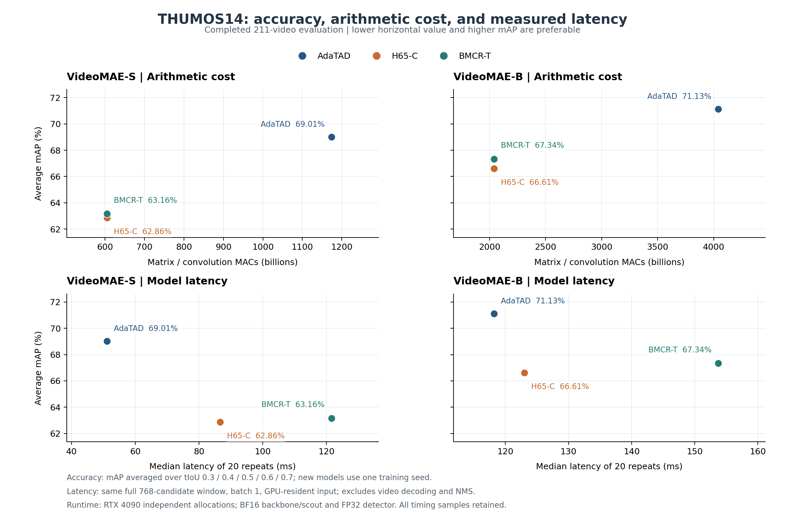

# BMCR-T on pristine OpenTAD AdaTAD

独立的 H65-C / BMCR-T 思想复现、完整训练和评测记录，覆盖 VideoMAE-S 与 VideoMAE-B。上游 OpenTAD 的模型、数据和评测源码保持原样，新方法在 `h65/full/` 中组合实现。

本分支 `codex/h65-fidelity-20260911` 开展新的 H65 保真修正实验，尚无新模型的完整测试结果。修正了 ASFormer 内部注意力投影误用分类头学习率的问题，并恢复随机裁剪后真实边界端点的有效性监督。两种骨干都重新从识别预训练开始，使用全部200训练视频完成20轮预热＋40轮联合训练；K384、global-TIA192及检测路径不变。28项CPU测试已通过，完整训练由真实S/B GPU预检共同放行。详见[本轮计划](fidelity_20260911/PLAN.md)。

按用户要求，在总轮次25、30、35、40、45、50、55、60对全部211测试视频评测EMA，以五阈值平均mAP峰值选模，相等时取较早轮次。所有60轮仍完整执行，并单列第60轮终点、完整测试曲线和选中检查点的计算量与时延。这是测试集选模结果，不能称为独立未见测试性能，也不能直接用它与旧固定终点的差值证明纯模型增益。

以下为已完成的旧配方实验，数值保留不变；可复核原始实现的分支为 [`codex/publication`](https://github.com/yuzbo/BMCR-T-AdaTAD/tree/codex/publication)。**旧结果不支持“在保持官方精度的同时实现推理加速”。** 新方法的矩阵/卷积 MAC 减少约一半，平均 mAP 仍低于官方基线，指定窗口的实测时延反而更高。BMCR-T 是输入研究报告提出的研究方案名称，本仓库不将它包装成已经发表或被证明有效的论文方法。

| Backbone | Method | Avg. mAP (%) | GMAC | MAC reduction | Mean / median latency (ms) |
|---|---|---:|---:|---:|---:|
| VideoMAE-S | Official AdaTAD |69.01|1173.95|—|51.21 /51.17|
| VideoMAE-S | H65-C |62.86|605.16|48.45%|92.84 /86.67|
| VideoMAE-S | BMCR-T |63.16|605.17|48.45%|121.91 /121.59|
| VideoMAE-B | Official AdaTAD |71.13|4041.08|—|118.31 /118.17|
| VideoMAE-B | H65-C |66.61|2038.72|49.55%|123.08 /123.02|
| VideoMAE-B | BMCR-T |67.34|2038.74|49.55%|153.75 /153.74|

平均 mAP 为 tIoU 0.3/0.4/0.5/0.6/0.7 的均值。所有方法完整测试211视频、792窗口。时延来自RTX4090独立作业中的同一完整768候选窗口，输入已在GPU，排除解码和NMS；它不是全测试集平均时延。矩阵/卷积FLOPs按2MAC计算，不包含所有逐元素运算。



## Read first

- [方法定义与实际实现](docs/METHOD.md)
- [完整实验协议与重跑说明](docs/PROTOCOL.md)
- [结果分析、可支持的结论和改进路线](docs/ANALYSIS.md)
- [外部审查源码导航](docs/REVIEW_MAP.md)
- [完整实验报告](phase2_20260910/EXPERIMENT_REPORT.md)、[所有阈值结果](phase2_20260910/RESULTS.md)、[未舍入总表](phase2_20260910/comparison.json)
- [外部模型讨论 prompt](https://github.com/yuzbo/BMCR-T-AdaTAD/blob/codex/publication/docs/EXTERNAL_REVIEW_PROMPT.md)
- [发布适配、验证范围和第三方来源](docs/PUBLICATION_NOTES.md)

上表旧实验的四个新模型各采用20轮均匀预热＋40轮联合训练，200视频每轮各参与一次随机窗口训练，batch2，每轮100次更新。每个骨干的预热只实际训练一次，H65-C和BMCR-T从相同预热末轮EMA分支。新模型使用K400识别预训练和新初始化的Adapter/检测器；官方仅测试现有TAD检查点，没有重新训练。上表固定使用旧模型末轮EMA，没有依据测试集选轮次；本分支新实验按前述峰值规则选模。

## Inspect the published evidence without a GPU

```bash
python tools/verify_results.py
H65_RUNS_DIR="$PWD/phase2_20260910/runs" python tools/full_compare.py
```

第一条只需Python标准库，核验六组指标、全部压缩预测、算子记录及20000次训练更新日志的一致性；它不代替使用标注重新计算mAP。第二条从每组记录再生成汇总。`phase2_20260910/runs/*_test/result_detection.json.gz` 包含全部预测，可用Python的gzip模块解压。

## Code and dependencies

`h65/full/` 是本轮完整实验入口；`h65/scout.py`、`h65/transport.py` 是实际依赖。其余根层 `h65/` 文件保留为早期原型来源，不能把原型的原网格恢复路径当成本轮selected-rank检测路径。

`upstream/` 收录OpenTAD固定提交的模型、数据、评测、配置及许可证源码；`references/ASFormer/model.py` 保留其原始MIT许可。无需通过子模块访问核心源码。训练数据、识别预训练、官方检查点和本次大型终点权重不随Git仓库分发。完整数值重跑仍需这些外部资源及相应CUDA环境，配置方法见[协议](docs/PROTOCOL.md)。

旧 `codex/publication` 版本只对资源路径、输出目录和集群启动脚本做了发布适配。本分支额外包含两项保真修正和中间测试选模/调度代码；原有实验数值没有被重新生成或覆盖。
