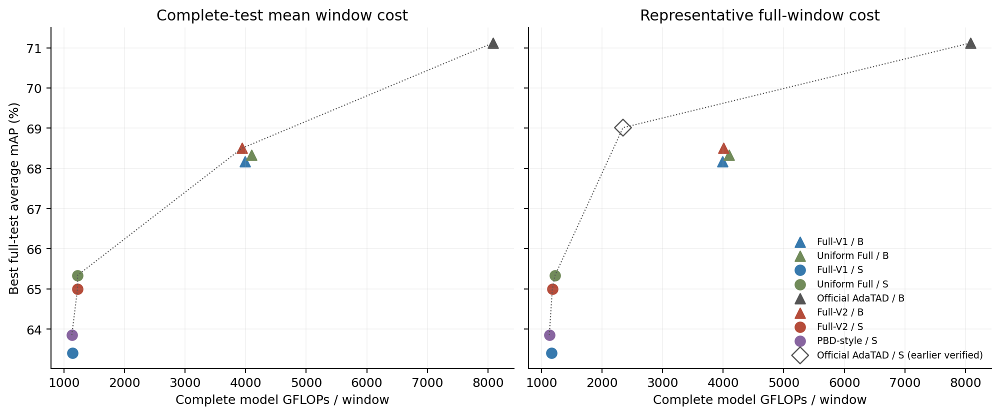
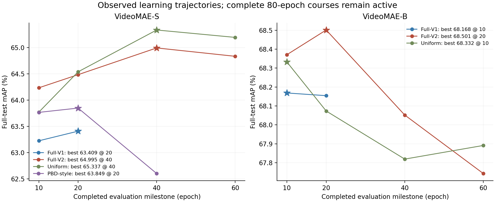

# WTR Publication Characterization Atlas

当前工作树用于2026-09-15在44909服务器执行的全数据反事实测量与CVPR标准科研绘图。入口为[执行状态与交接](research/atlas_20260915/STATE.md)、[冻结协议](research/atlas_20260915/PROTOCOL.zh.md)和[Dense-S真实回执](research/atlas_20260915/receipts/baseline_s.json)。当前源码为 `h65/atlas/` 与 `tools/atlas_*.py`，不启动新WTR训练。

官方Dense-S/B均已完成211视频/792窗口：S为68.9767%、2347.894 GFLOPs/窗口；B为71.1417%、8082.155 GFLOPs/窗口。S正式时间分配测量与B干预验收正在进行，后续由唯一两GPU队列及当前任务的自动跟进继续。完整结果和视觉QA通过后才发布正式图。

以下保留从1955057继承的历史项目说明，其中“当前”均指2026-09-14的原集群快照，不是本次AutoDL执行状态。

## 历史H65 / BMCR与Graph项目记录

**项目统一入口，2026-09-14 20:39（北京时间）服务器快照。** 当前分支 `codex/graph-tad-20260914` 汇集最新实现、已保存结果、实际部署记录和历轮研究指令。它是进行中的科研项目；未测模型不会被画成性能点。

**当前结论：实现和持久队列已覆盖多个完整候选，论文的核心优越性仍待实验确认。** Graph 已实现并部署，S/B GPU预检已提交但仍排队；原版 AdaTAD 直接等间隔降采样同样尚无 mAP。当前有成绩的 Uniform Full 是包含 Cross 和 D/S 训练的内部框架对照。

|查看内容|统一入口|
|---|---|
|最新任务落实、部署、训练和最佳性能|[完整进度报告](research/project_status_20260914/STATUS.zh.md)|
|86个配置、84个训练课程|[配置总表](research/project_status_20260914/EXPERIMENTS.zh.md) · [机器可读索引](research/project_status_20260914/experiment_index.json)|
|410个实际部署阶段、作业和依赖|[阶段总表](research/project_status_20260914/STAGES.zh.md) · [实际命令/回执](research/project_status_20260914/stage_index.json)|
|模型、训练、评测、计费代码|[实现索引与边界](research/project_status_20260914/IMPLEMENTATION.zh.md)|
|原始建议、agents命令、取消和修订记录|[历轮指令索引](research/project_status_20260914/COMMANDS.zh.md)|
|论文故事、证据缺口、图表和接下来的实验|[论文进度与可支持主张](research/project_status_20260914/PAPER.zh.md)|
|95次唯一完整测试：71历史＋24当前|[全部结果](research/paper/graph/monitor_20260914_1959/analysis/full_results.json) · [当前最佳](research/paper/graph/monitor_20260914_1959/analysis/best_results.json)|
|直接核对服务器记录|[20:39原始快照](research/project_status_20260914/publication_snapshot.json) · [统计摘要](research/project_status_20260914/summary.json)|

## 当前完整测试的最佳成绩

THUMOS14：200训练视频；211测试视频、792窗口；当前训练均为seed42。mAP为tIoU 0.3–0.7五阈值平均。下表取预登记里程碑中的已测EMA峰值，**不是80轮最终结果，也不是独立未见测试集选模**。GFLOPs是全测试窗口平均的完整模型矩阵/卷积计算；固定代表窗、时延和训练成本另报。

|模型|S最佳 mAP / epoch|S平均 GFLOPs/窗|B最佳 mAP / epoch|B平均 GFLOPs/窗|
|---|---:|---:|---:|---:|
|Full-V1|63.4087 / 20|1147.25|68.1685 / 10|3988.33|
|Full-V2|64.9949 / 40|1225.98|**68.5014 / 20**|3940.85|
|Uniform Full|**65.3369 / 40**|1226.48|68.3322 / 10|4094.32|
|PBD-style|63.8488 / 20|1131.74|待测|—|
|原版AdaTAD K384直接降采样|待测|—|待测|—|
|Graph各候选|待测|—|待测|—|
|官方dense AdaTAD本轮复测|待本轮复测|—|71.1204|8082.15|

Full-V2-B峰值比Uniform-B高0.1692pp，计算量低约3.75%；S上Uniform仍更高。同60轮，Full-V2的S/B mAP分别为64.8354/67.7427，Uniform为65.1959/67.8910。不能用各自峰值掩盖同轮比较。历史官方S为69.0126%，其旧固定窗2347.89G单独保留，不冒充新测全测试平均值。





## 最新部署

唯一调度器为 `paper_20260913` 的PID `3506502`。84个训练课程中：4运行、1等待Slurm、79在持久队列；本轮完整训练终点完成数为0。已完成11个调度阶段主要是技术预检、官方复测和配对分析，不能算作11个完整训练。

- 运行：Full-V2 B、Uniform Full S/B、PBD-style S。Full-V2-S在7877/8000更新完成预定时间切片，保存断点后等待续跑；不是科学早停。
- 等GPU：PBD-B `1289883`；原版AdaTAD K384 S/B `1289969/1289968`；K768 B参考 `1290143`；Graph Full S/B技术预检 `1290083/1290082`。
- Graph新增7配置、36阶段：G-Repair-S、G-Context-S、G-Full-S/B各80轮；固定局部图、无referral、full-KV三个S控制各40轮，使用80轮LR前缀。10项CPU检查及7种真实资产构建通过，尚无GPU通过或Graph成绩。
- ActivityNet正在已有Uniform-S allocation内用1个CPU补齐数据，额外GPU为0；截至快照日志至少14312/14752已准备，尚无READY。InternVideo1-MQ和TadTR训练配置已登记，尚无完整成绩。

训练进度、断点轮转、技术失败修复、各配置轮次和未完成项见[进度报告](research/project_status_20260914/STATUS.zh.md)。资源轮转保留optimizer/EMA/RNG，不以早期成绩淘汰路线。

## 方法和复现口径

H65、BMCR/BMCR-T、Cross、FPW及Carrier是作者内部路线，不能列为独立公开论文基线。原DS3、T24/U24和原16候选clip选择路线保持取消；源材料和已完成证据仍保存。当前VideoMAE内部16帧打包不属于被取消的选clip路线。

本分支活动源码为 `h65/paper/`；Graph部署科学版本是 `841307e3af9ad6547535a61c9c0b23b9f308f383`，Native AdaTAD为 `0313f136d076552e84a459b91869ad59169f4c3b`。不同运行保留自己的source_revision；后续文档提交不回填为旧结果的代码版本。

当前主候选仍复用任务训练资产和训练期teacher。可训练的是student readout、Adapter及新增模块等，并不等于所有VideoMAE参数全量微调。无外部查询、识别预训练起点、全量微调等控制已经登记，尚不能宣称已摆脱dense任务资产依赖。

仓库包含源代码、配置、第三方源码/许可、原始研究包、回执、数值表和图。训练视频、官方大权重和远端实验checkpoint不随Git传输；其资源/结果来源索引保留。资源加载规则见[当前runtime](h65/paper/runtime.py)，环境来源见[历史复现协议](docs/PROTOCOL.md)；真实资源路径保存在运行回执中。

仅重建本次进度索引（Python标准库，无GPU、不提交实验）：

```bash
python tools/paper_project_status.py --snapshot research/project_status_20260914/publication_snapshot.json --results research/paper/graph/monitor_20260914_1959/analysis/full_results.json --output research/project_status_20260914
```

此前README已[原样归档](research/project_status_20260914/README_before_consolidation.md)；其中“当前”均指各历史日期，不能覆盖本页的最新回执。
