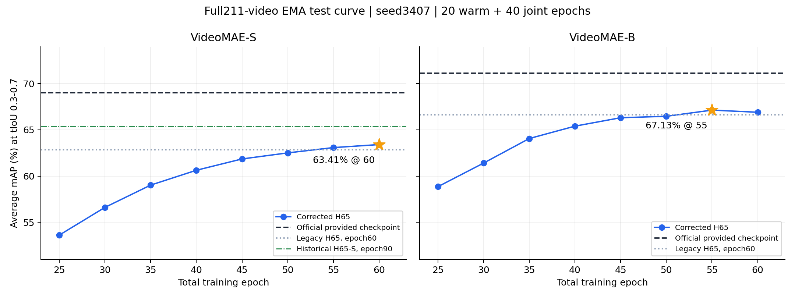

# H65 / BMCR-T on pristine OpenTAD AdaTAD

**当前入口：完整论文实现与外部深入讨论材料（2026-09-13）。** 请先读[统一交接索引](research/discussion_20260913/README.zh.md)、[52个seed42完整实验](research/discussion_20260913/EXPERIMENTS.zh.md)、[源码与有效结果导航](research/discussion_20260913/IMPLEMENTATION_AND_EVIDENCE.zh.md)、[历轮agents原始指令及当前用户约束](research/discussion_20260913/USER_DECISIONS_AND_COMMANDS.zh.md)。活动源码为`h65/paper`，实验状态以带时间戳的回执为准；下方旧阶段叙述按历史保留。

[可直接复制给外部模型的深入讨论Prompt](research/discussion_20260913/DEEP_DISCUSSION_PROMPT.zh.md)固定材料提交5485c3c，覆盖论文主线、三轴冗余、深度/空间性能保持、PBD、官方VideoMAE decoder初始化、联合采样/路由/自蒸馏、公开对比、图表与下一步实验；只提出问题，不预设答案。

**方法归属：H65、BMCR/BMCR-T是本项目作者提出的自研方法及内部基线，Cross/FPW为本项目后续内部实验；均不能当作独立公开论文竞争方法。** 公开AdaTAD等方法与内部历史/消融明确分开。当前每完整配置仅seed42一次；旧seed文件仅作历史，原DS3与原16候选clip选择路线保持取消。

**当前新实验：修正BMCR S/B总80轮（2026-09-13用户授权）。** 本工作树复用已完成修正warm20EMA，新增joint60；每5个总epoch25..80完整测试，保留峰值、60、80的曲线和profile。新目录`bmcr80_20260913/`与旧实验隔离。[实验计划](bmcr80_20260913/PLAN.zh.md)；[BMCR后续研究建议](bmcr80_20260913/RESEARCH_NEXT.zh.md)。部署/训练状态以新实验receipt为准，计划不等于已有新成绩。下方DS3取消记录继续有效。

**2026-09-13最新用户决定：取消所有原16候选clip选择路线和实验，以H65/BMCR为第一基线。** DS3控制器、S训练和T24A40评测已停止，57个未完成阶段撤销，自动跟进删除；16个已完成阶段和S41轮/4100更新检查点保留。后续优先完成修正H65/BMCR同配方比较，不再推进T24/U24、原clip残差C2或该路线的深度/空间组合。[当前研究方向](docs/RESEARCH_DIRECTION.zh.md)。下方DS3计划、快照和外部prompt作为历史记录保留，原继续八十轮安排已失效。

本项目作者自研 H65-C / BMCR-T 的实现、完整训练和评测记录，覆盖 VideoMAE-S 与 VideoMAE-B。早期基线在 `h65/full/` 中组合实现；最新模型在 `h65/paper/`，上游来源及修改范围以对应版本记录为准。

[命令文件与未完成实验审计（2026-09-13 00:06）](ds3_20260912/command_audit_20260912/REPORT.zh.md)提供197份相关文件实例的索引、实际73阶段调度命令，以及各实验的设计、要验证的假设和实现/部署缺口。当前DS3为14阶段完成、2运行、57等待；S已保存36/80轮。修正BMCR仍未注册新训练，G/F为未接通的草稿，C2/J3/STM与知识桥接尚无完整实现。

[可直接复制给外部研究模型的完整Prompt](docs/BMCR_THREE_DIMENSION_RESEARCH_PROMPT.zh.md)固定审查提交`239d098cd899936c35989fae6243c70259a85adb`，要求围绕已有BMCR/H65成果研究帧/clip选择、空间/深度去冗余、训练与推理异构性及跨领域可迁移机制。该Prompt用于研究讨论，不代表已经启动其中提出的新实验。

[最新固定研究上下文（2026-09-12 21:56）](ds3_20260912/research_context_20260912/CONTEXT.zh.md)：S D1已保存15/80轮、1500/8000更新；第5轮EMA全测试mAP50.6458%，第10轮测试运行中。Z16/24/36分别43.2835/56.1065/62.5804%，ZR24为53.0022%。这些是零训练控制与早期训练结果，完整80轮结论尚未产生；修正BMCR已经授权，当前仅完成warm准备核对，尚无新训练结果。

[完整实验回顾（截至2026-09-12 20:02）](ds3_20260912/retrospective_20260912/REPORT.zh.md)整理了初期诊断、旧H65/BMCR、保真修正、历史65+来源、全部主要精度/计算/时延/训练成本、失败与勘误，以及最新DS3参考结果。已完成两轮训练合计32000实际更新、34.3492记录GPU小时；80轮D1结果尚未产生。

[BMCR纠错、Z24解释与后续方案](ds3_20260912/decisions_20260912/DECISION.zh.md)区分已确认问题、可复用的修正warm、D1训练边界和后续C2/J3建议，并给出基于实测算子分项的深度/空间预算估算。该分析未改变当前80轮配方，也未启动新的纠正BMCR或C2/J3训练。

当前分支 `codex/h65-ds3-20260912` 新增 DS3-L：完整dense前向辅助蒸馏，推理时按clip执行0/8/12层，后4层可仅执行部分heavy MLP；保持native384到原detector768的时间接口。新的S/B预算为80epoch，各8000更新，全部200训练视频、211测试视频、单种子3407，每5轮完整测试并保留60/80。提供的官方TAD教师和检测器冻结，H0额外使用ImageNet MobileNetV3Small预训练。局部TIA8转换与官方global384分别评测，尚无完整80轮DS3精度保持或端到端加速结论。[方案判断](ds3_20260912/ASSESSMENT.zh.md) · [80轮实验配方](ds3_20260912/PLAN.md) · [实现与验证](ds3_20260912/IMPLEMENTATION.md)。

此前 `codex/h65-fidelity-20260911` 的 H65 保真修正实验已完成：纠正 ASFormer 内部注意力投影误用分类头学习率的问题，恢复随机裁剪后真实边界端点的有效性监督。S/B各从识别预训练开始，在全部200训练视频上完成20轮预热＋40轮联合训练，固定seed3407；K384、global-TIA192及检测路径不变。全部12000次更新、16次完整211视频/792窗口评测，以及峰值和终点的计算量/时延测量均已完成。

按用户要求，在总轮次25、30、35、40、45、50、55、60评测EMA，以五阈值平均mAP峰值选模，同分取较早轮次。选中S第60轮、B第55轮；B第60轮终点为66.9026%。这是测试集选模结果，不能称为独立未见测试性能。

| 骨干 | 选中轮次 | 平均mAP | FLOPs/对应官方 | 平均/中位时延ms |
|---|---:|---:|---:|---:|
| VideoMAE-S | 60 |63.4094%|51.5488%|86.98 /86.89|
| VideoMAE-B | 55 |67.1328%|50.4499%|129.39 /122.47|

相同第60轮终点相对旧H65-C提高S0.5501、B0.2898个百分点，B峰值选模另增加0.2302个百分点。S仍未恢复历史65.3857%；现有曲线不能统一证明“S/B都因60轮不足而掉分”。矩阵/卷积FLOPs约减半，但指定窗口实测未实现推理加速。时延不含解码/NMS、非全测试集均值；B55的全部20次计时保留了253.66ms长样本。

[最终报告与60轮课程分析](fidelity_20260911/FINAL_REPORT.md) · [完整中间曲线与预测](fidelity_20260911/INTERMEDIATE_RESULTS.md) · [选中检查点](fidelity_20260911/SELECTED_CHECKPOINTS.json) · [未舍入比较](fidelity_20260911/FINAL_COMPARISON.json) · [最终验证](fidelity_20260911/FINAL_VALIDATION.json)



以下为已完成的旧配方实验，数值保留不变；可复核原始实现的分支为 [`codex/publication`](https://github.com/yuzbo/BMCR-T-AdaTAD/tree/codex/publication)。**旧结果不支持“在保持官方精度的同时实现推理加速”。** 新方法的矩阵/卷积 MAC 减少约一半，平均 mAP 仍低于官方基线，指定窗口的实测时延反而更高。BMCR-T 是输入研究报告提出的研究方案名称，本仓库不将它包装成已经发表或被证明有效的论文方法。

| Backbone | Method | Avg. mAP (%) | GMAC | MAC reduction | Mean / median latency (ms) |
|---|---|---:|---:|---:|---:|
| VideoMAE-S | Official AdaTAD |69.01|1173.95|—|51.21 /51.17|
| VideoMAE-S | H65-C |62.86|605.16|48.45%|92.84 /86.67|
| VideoMAE-S | BMCR-T |63.16|605.17|48.45%|121.91 /121.59|
| VideoMAE-B | Official AdaTAD |71.13|4041.08|—|118.31 /118.17|
| VideoMAE-B | H65-C |66.61|2038.72|49.55%|123.08 /123.02|
| VideoMAE-B | BMCR-T |67.34|2038.74|49.55%|153.75 /153.74|

平均 mAP 为 tIoU 0.3/0.4/0.5/0.6/0.7 的均值。所有方法完整测试211视频、792窗口。时延来自RTX4090独立作业中的同一完整768候选窗口，输入已在GPU，排除解码和NMS；它不是全测试集平均时延。矩阵/卷积FLOPs按2MAC计算，不包含所有逐元素运算。


## Read first

- [当前保真修正计划](fidelity_20260911/PLAN.md)、[完整训练记录](fidelity_20260911/TRAINING_COMPLETION.md)、[最终报告](fidelity_20260911/FINAL_REPORT.md)
- [旧配方的方法定义与实际实现](docs/METHOD.md)
- [旧配方的实验协议与重跑说明](docs/PROTOCOL.md)
- [旧结果分析和改进路线](docs/ANALYSIS.md)
- [外部审查源码导航](docs/REVIEW_MAP.md)
- [完整实验报告](phase2_20260910/EXPERIMENT_REPORT.md)、[所有阈值结果](phase2_20260910/RESULTS.md)、[未舍入总表](phase2_20260910/comparison.json)
- [外部模型讨论 prompt](https://github.com/yuzbo/BMCR-T-AdaTAD/blob/codex/publication/docs/EXTERNAL_REVIEW_PROMPT.md)
- [发布适配、验证范围和第三方来源](docs/PUBLICATION_NOTES.md)

上表旧实验的四个新模型各采用20轮均匀预热＋40轮联合训练，200视频每轮各参与一次随机窗口训练，batch2，每轮100次更新。每个骨干的预热只实际训练一次，H65-C和BMCR-T从相同预热末轮EMA分支。新模型使用K400识别预训练和新初始化的Adapter/检测器；官方仅测试现有TAD检查点，没有重新训练。上表固定使用旧模型末轮EMA，没有依据测试集选轮次；本分支新实验按前述峰值规则选模。

## Inspect the published evidence without a GPU

当前分支的全部16组指标、验证记录和压缩预测位于 `fidelity_20260911/evaluations/`；使用Python标准库运行 `python tools/fidelity_progress.py` 可重建已公开的中间结果表。`tools/fidelity_finalize.py` 在收集完整远端runs/deployment记录后生成最终报告及图表。重新计算mAP本身仍需THUMOS标注。

下面两条用于检查旧配方的公开证据：

```bash
python tools/verify_results.py
H65_RUNS_DIR="$PWD/phase2_20260910/runs" python tools/full_compare.py
```

第一条只需Python标准库，核验六组指标、全部压缩预测、算子记录及20000次训练更新日志的一致性；它不代替使用标注重新计算mAP。第二条从每组记录再生成汇总。`phase2_20260910/runs/*_test/result_detection.json.gz` 包含全部预测，可用Python的gzip模块解压。

## Code and dependencies

`h65/full/` 是本轮完整实验入口；`h65/scout.py`、`h65/transport.py` 是实际依赖。其余根层 `h65/` 文件保留为早期原型来源，不能把原型的原网格恢复路径当成本轮selected-rank检测路径。

`upstream/` 收录OpenTAD固定提交的模型、数据、评测、配置及许可证源码；`references/ASFormer/model.py` 保留其原始MIT许可。无需通过子模块访问核心源码。训练数据、识别预训练、官方检查点和本次大型终点权重不随Git仓库分发。完整数值重跑仍需这些外部资源及相应CUDA环境，配置方法见[协议](docs/PROTOCOL.md)。

旧 `codex/publication` 版本只对资源路径、输出目录和集群启动脚本做了发布适配。本分支额外包含两项保真修正和中间测试选模/调度代码；原有实验数值没有被重新生成或覆盖。
