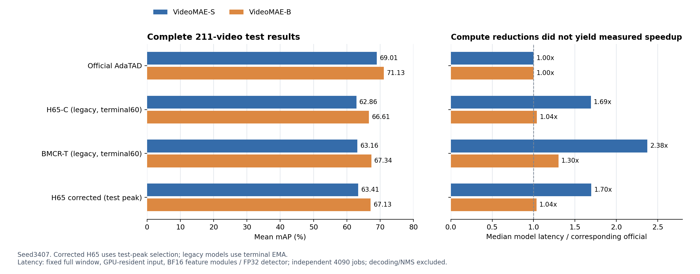

**H65 / BMCR-T / DS3-L 实验记录完整回顾**

记录截止：2026-09-12T20:02:30.385110+08:00。数值来自已保存的评测JSON、训练完成记录和本次只读远端快照；本次整理没有启动额外训练、改写旧分数或改变在运行的80轮配方。

**已经成立的结论是：重骨干计算确实减少，官方精度和实际速度尚未同时保持。** 旧 BMCR-T 在两种骨干上改善了旧 H65 的平均mAP，但收益有限；修正学习率和裁剪边界后，H65有所恢复，仍未达到历史65+。当前DS3-L的密集参考、局部转换与零新增训练Z0对照已有评测，不能把它们当作完成80轮D1辅助训练的成绩。

已完成的旧配方和保真修正两轮主实验，共有6条完整模型训练路线、10个实际训练阶段、32,000次正式更新、34.3492个记录训练GPU小时，以及22次完整211视频评测。共享预热只计一次；历史90轮、初期诊断、GPU预检、审计、测试、排队及当前DS3都不计入上述训练小时。DS3本次快照另有3项完整参考评测。

**实验名称相近，但每一阶段解决的问题和已完成范围不同。**

|阶段|模型/任务|实际完成内容|不可混淆的边界|
|---|---|---|---|
|历史H65|VideoMAE-S，30+60轮|收回原始65.385724%终点评测回执与训练日志|历史实验；本项目未重新跑这90轮|
|初期机制验证，09-10|纯净OpenTAD上的H65思想原型|一个训练视频的两个重叠窗口、2步最终诊断权重、连接/梯度/换帧检查|无完整训练、无全测试mAP|
|旧配方完整实验，09-10至09-11|S/B × H65-C/BMCR-T|4条60轮路线，6项官方/新模型完整测试及profile|旧LR分组和裁剪边界缺口仍在这些模型中|
|两轮外部复审，09-11|15280e5固定源码与意见包|58项与45项主体复核，源码/实际参数/算术/文献对照|复审结论不是新模型性能|
|保真修正，09-11至09-12|S/B H65，20+40轮|重建新warm，修LR/边界，16次全测试，峰值/终点profile|没有按修正配方重训BMCR，也未完成独立G/F|
|DS3-L，09-12起|S/B D1，80轮计划|辅助模块、0/8/12执行与MLP稀疏实现；S/B真实GPU预检和参考评测|80轮新模型性能尚未产生；C2/J3未实施|

**所有完整主实验都使用200条训练视频、211条测试视频。** THUMOS14训练视频在资源目录中叫Validation Data；测试目录是TH14_test_set_mp4。程序中test使用的annotation subset名称为validation，不表示拿训练集评测。实测数据ID集合互不相交，测试滑窗共792个，动作类别20。旧记录中的199条说法已被实际文件、标注及加载器核对纠正为200。

每轮对200个训练视频各抽取一次标准随机窗口，batch2，故每轮100个优化器更新；这不等于每轮穷举每个视频的全部滑窗。候选步幅是4个原视频帧，768个候选观察不是连续768张原视频帧。mAP均值取tIoU0.3/0.4/0.5/0.6/0.7五个阈值，不能与单独@0.5混用。

“完整训练”指完整课程与完整训练集覆盖，不表示所有VideoMAE参数都训练。旧H65/BMCR和修正H65冻结非Adapter的VideoMAE参数，训练Adapter、ActionFormer检测部分及scout；DS3 D1进一步冻结提供的TAD教师和检测器，只更新辅助模块。冻结不代表跳过前向计算。

**预热确实训练ASFormer，但它不是官方AdaTAD的完整768均匀训练复现。** 旧配方及修正H65的20轮warm采用均匀K384；Adapter、检测器以及低分辨率CNN+ASFormer的动作/转变辅助任务都训练。后40轮为20轮过渡与20轮完整联合；检测反馈先预热667更新、再放开1333更新。batch2内的均匀companion来自另一行自己的视频/GT，不是同一视频的双视图输出蒸馏。

|对象|初始化|训练预算|优化与选择|
|---|---|---|---|
|官方 S/B|提供的TAD EMA，checkpoint epoch字段59/51|本项目不重训|仅严格加载并完整测试；字段不推断原始总轮数|
|旧H65-C/BMCR-T|K400识别预训练；新Adapter/检测器|公共warm20一次/骨干；各joint40；6000步/路线|AdamW，EMA0.999，末轮EMA；没有本轮测试峰值选模|
|修正H65 S/B|重新从识别预训练开始，自己的新warm|20+40，各6000步|同类课程；总25至60每5轮完整测试，按测试峰值选EMA|
|DS3-L D1 S/B|提供的官方TAD权重冻结；H0额外ImageNet MobileNetV3Small|80轮，各8000步；100步pilot就是第1轮|aux AdamW1e-4，500步线性LR预热后余弦至8000；每5轮T24A全测试，保留60/80|

H65/BMCR的Adapter基础LR为S2e-4、B1e-4；检测器1e-4；scout warm的trunk/action/scorer为5e-5/1e-4/5e-5，joint为1e-5/2e-5/5e-5。warm/joint学习率预热分别2/3轮，之后余弦衰减。旧版实际误把18,816个内部投影参数分到两倍的action LR，后面的“修正H65”才按参数身份改正。旧PLAN中“已经在正式训练前正确分组”的表述与实际运行不符，不能继续引用为事实。

**已完成的新模型成绩应同时看精度、计算量和时延。** 下表来自两轮完成报告，使用对应官方参考作为分母；修正S峰值也是第60轮终点。FLOPs单位为GFLOPs，时延是平均/中位ms，显存为该次推理的peak allocated GiB。

FLOPs按实际执行的矩阵/卷积2MAC计数，包含融合注意力QK和AV，不包含softmax、归一化及所有逐元素算术。旧实验与修正实验的主profile统一使用完整768候选窗口video_test_0000007、起点0、测试index2；另保留503候选部分窗和253候选短窗。计时为batch1、输入已在GPU、BF16骨干/scout和FP32检测器，5次预热后保留20次同步调用；包含路由/骨干/Adapter/检测及NMS前回映，排除视频读取、解码和NMS。不同作业可能位于不同4090节点，因此不是同卡交错实验或全视频端到端时间。

|骨干|方法|权重选择|平均mAP|对官方差值pp|GFLOPs|FLOPs/官方|模型时延ms|推理GiB|
|---|---|---|---|---|---|---|---|---|
|S|官方 AdaTAD|提供权重|69.0126%|—|2347.894|100.0000%|51.21 / 51.17|0.9354|
|S|旧 H65-C|第60轮终点|62.8593%|-6.1532|1210.310|51.5488%|92.84 / 86.67|0.8613|
|S|旧 BMCR-T|第60轮终点|63.1563%|-5.8563|1210.345|51.5503%|121.91 / 121.59|0.8613|
|S|修正 H65|第60轮峰值|63.4094%|-5.6032|1210.310|51.5488%|86.98 / 86.89|0.8613|
|B|官方 AdaTAD|提供权重|71.1280%|—|8082.155|100.0000%|118.31 / 118.17|1.5080|
|B|旧 H65-C|第60轮终点|66.6128%|-4.5152|4077.440|50.4499%|123.08 / 123.02|1.1233|
|B|旧 BMCR-T|第60轮终点|67.3404%|-3.7875|4077.476|50.4504%|153.75 / 153.74|1.1234|
|B|修正 H65|第55轮峰值|67.1328%|-3.9952|4077.440|50.4499%|129.39 / 122.47|1.1233|
|B|修正 H65|第60轮终点|66.9026%|-4.2254|4077.440|50.4499%|123.38 / 123.24|1.1233|

旧H65/BMCR是末轮EMA，修正H65是按用户要求的中间测试峰值；两类选择口径不同。官方权重的训练课程与新模型不同，故官方差距不是“只更换一个采样模块”的单变量消融。所有新路线为seed3407的单种子结果，不据此宣称统计显著性。

图中修正H65使用测试峰值，旧模型使用终点；历史90轮和当前未训练完的DS3不并入柱形排名。中位时延也仍高于对应官方参考，计算量减半没有在已完成模型中转化为推理加速。

S/B的旧H65各有相同18.5338GMAC的scout开销；它在S总计算中的占比更大，因此即使重骨干clip都减半，总FLOPs比例仍分别为51.5488%和50.4499%。这是计算占比的解释，不是S精度下降更多的因果解释。动态索引、校准、同步等耗时也不能按MAC占比直接分摊。推理显存同样没有减半：修正S约0.8613GiB，B约1.1233GiB，分别只较对应参考降低约7.92%和25.51%。

**BMCR-T带来的收益集中在有限的平均mAP改善，不能表述为全面保持检测能力。** 该名称是本项目按提案实现的固定预算反事实时序路由方案，不是已经确认发表论文的官方复现。它在同一K384核心上增加候选、相反成员伙伴与集合上下文，用EMA教师测量带符号的分类/原时间定位交换效用，以Huber监督替换旧贡献分布监督；每8次联合更新尝试可行交换，推理不使用GT。

|骨干|BMCR−旧H65平均mAP(pp)|BMCR对官方差值(pp)|BMCR相对官方mAP损失|@0.5变化(pp)|@0.7变化(pp)|
|---|---|---|---|---|---|
|S|+0.2970|-5.8563|8.4858%|-0.4187|-0.3020|
|B|+0.7276|-3.7875|5.3250%|+0.7474|+1.0387|

百分点与相对百分比不同。例如旧H65-S低于官方6.1532个百分点，相对mAP损失8.9161%；B低4.5152个百分点，相对损失6.3480%。S的相对差距更大是真实观测，尚不能单独归因于小模型容量、时间表征、LR错误或课程长度。较严格阈值下的损失更明显也不能直接等同于纯回归错误，因为排序与召回同样参与mAP。

训练集上的128窗口交换审计，S/B各得到390次可测交换，310次用于拟合/尺度估计，80次来自15个留出训练视频。旧绝对贡献代理在留出交换上的分类/定位Spearman为S−0.0302/−0.0283、B0.1259/−0.2034，弱且不一致；这不是最终BMCR效用头的精度。每个BMCR联合阶段日志各有355次非空事件，可重建1065条教师路由前向；它是前向行数，不是训练FLOPs或耗时百分比。

**两项保真修正有实际收益，但没有解释完整历史差距。** LR修复将四个attention内部输出投影归回trunk LR，真正两个动作分类头只有388个参数；裁剪边界修复通过gt_boundary_validity排除随机窗口制造的假起止点。两者同时应用，没有分开的消融，因此不能分摊各自mAP贡献。

|骨干|旧H65第60轮|修正第60轮|相同终点变化pp|修正峰值|峰值选择额外变化pp|
|---|---|---|---|---|---|
|S|62.8593%|63.4094%|+0.5501|63.4094%|+0.0000|
|B|66.6128%|66.9026%|+0.2898|67.1328%|+0.2302|

修正训练四阶段共记录2938/12000个batch含裁剪制造端点，约24.48%；这是训练日志中重复样本/窗口的统计，不是独立视频或动作数量。它说明边界有效性问题在真实训练中出现，但仍不能将全部分数差距归给它。

|总epoch|S平均mAP|B平均mAP|
|---|---|---|
|25|53.6248%|58.8581%|
|30|56.6237%|61.4086%|
|35|59.0293%|64.0615%|
|40|60.6321%|65.3995%|
|45|61.8558%|66.3111%|
|50|62.5107%|66.4645%|
|55|63.0833%|67.1328%|
|60|63.4094%|66.9026%|

全部16个中间点都完整测试211视频/792窗口。S从55到60轮仍上升0.3261pp，B同期下降0.2302pp，因此“60轮一定不够”尚未被统一证实。按测试峰值选模是用户指定流程，不能称为未见测试集上的无偏泛化成绩。旧BMCR没有采用修正配方重训，不能用旧BMCR与新H65直接回答修正后的BMCR增量。

**历史65+是真实回执，但它属于另一条90轮课程。** 固定实现为42dba3f90b37243e7965d18b6707e88e81bf7109，stage2 epoch59 EMA，211视频，平均mAP65.3857244379457%。这里epoch59是第二阶段的第60轮，前面还有30轮warm；不是总60轮。历史日志晚期峰值约65.65是四舍五入日志值，不能代替终点回执65.385724。

历史恢复段从joint epoch9继续，原作业1191957最终FAILED来自训练后收据冲突；更新审计仍确认后50轮的5000次成功更新，补评1193610完成。原评估器与当前纯净OpenTAD mAP.py逐字节一致。65.39对应global-TIA192，与当前H65一致；较晚04c35a3采用local-TIA8，不能倒推它生成了65.39。

旧S终点62.8593比历史65.3857低2.5264pp；修正S63.4094仍低1.9763pp。历史90轮课程中的总60轮日志约64.40，也不是本次20+40课程的等价时点。新DS3的80轮既更换训练对象又更换结构/初始化，不能拿它与旧60轮直接声称测出了纯延长20轮的因果收益；本次DS3内部第60到80轮的变化才是同一新轨迹的训练收益观察。

**从原型到当前模型，时间轴和观察预算有几次明确变化。**

|路线|重RGB/clip预算|native时间长度|检测轴|TIA与填充|
|---|---|---|---|---|
|官方密集|768候选，48×16|384|原768|全局384；上游edge padding|
|最初两步原型|K384，24×16|192|按物理中心插值到原768|全局192；仅诊断|
|旧/修正H65与旧BMCR|K384，24×16|192|selected-rank384，NMS前回映原轴|全局192；无效packed RGB清零|
|DS3-L密集参考|768，48完整clip|384|原768|局部8；与官方全局转换单测|
|DS3-L T24/DAD等|原clip身份上的0/8/12层条件执行|拼回native384|原768|局部8；保留每clip的8个tubelet；重MLP可稀疏|

H65的K384是384个RGB物理槽位，不是192帧；192是两个观察组成一个tubelet后的特征数。短窗实际有效观察可少于384，但旧实现仍执行固定24clips。DS3保留完整原clip内部观察次序，尾窗也可能有部分有效clip，不能对所有窗口宣传exact384有效观察。原时间输出回映不等于修复骨干内不规则时间间隔，也不凭空恢复未观察的视觉信息。

**当前DS3有新的完整参考结果，但尚未产生训练后模型成绩。**

|本轮策略|平均mAP|GFLOPs|FLOPs/本轮官方|模型平均/中位ms|
|---|---|---|---|---|
|s_D768G|69.0126%|2347.894|100.0000%|67.87 / 64.77|
|s_D768L|67.5344%|2347.894|100.0000%|64.11 / 64.01|
|s_Z24|56.1065%|1188.403|50.6157%|42.60 / 42.56|

S局部密集转换从69.0126%降至67.5344%，变化-1.4781pp；FLOPs未减少，因为仍执行全部48clips和12层。这项变化发生在稀疏采样/辅助训练之前，必须与后续采样损失分开。它也再次证明：同一权重严格加载、全选局部路径等价，都不意味着local-TIA与官方global-TIA功能等价。

零新增训练Z24将48个原clip中均匀选出的24个完整clip送入局部重骨干，再按原中心插值到native384；平均mAP为56.1065%，相对局部密集另降11.4279pp，相对官方共降12.9061pp。在完整窗口上，实际12层均执行24clips，FLOPs为官方的50.6157%。固定窗口GPU平均/中位时延42.60/42.56ms，低于本轮官方67.87/64.77ms，但全数据评测1229.65秒与官方1236.41秒接近，未证明完整流水线的有意义加速。它是精度明显下降的零训练对照，不是已训练D1，更不证明80轮一定能补回这部分损失。

本轮官方S的模型平均/中位时间为67.87/64.77ms，与旧官方51.21/51.17ms不是同一次作业测量；当前时延包含DS3评测封装中的特征装配和路由元数据。全数据官方S评测1236.41秒包含解码、CPU变换、传输、模型及NMS，不含AP计算/预测文件写入，缓存状态未控制；不能把这三种时延口径混为一谈。

D1训练保留全部48clips、全部12层和全部tokens前向，只优化H0低分辨率预测、H8最终特征对齐、后4层低秩MLP近似及空间评分。推理才压紧clip/深度和后4层heavy MLP输入；attention/TIA仍保持其所需栅格。它与旧BMCR的EMA反事实效用监督不同，不再声称旧方法已经实现检测输出自蒸馏。

S/B实际预检1287657均完成2次batch2辅助更新，直接比较确认教师/检测器参数及buffer不变，辅助组确实更新，EMA严格重载和稀疏预测有限。CPU7项检查也通过。当前只读快照中自己的队列为：1287768|ds3-s_Z16|PENDING|(Priority); 1287766|ds3-s_pilot|PENDING|(Priority)。完整的后续计划为参考/Z0→100步pilot→80轮D1→中间T24A全测试→同一选中EMA的固定策略对照；不因本次报告新增训练。

**运行开销应按实际阶段计算，共享预热不能重复计费。**

|实验|骨干|阶段|成功更新|记录GPU小时|作业/备注|
|---|---|---|---|---|---|
|旧配方|S|公共warm|2000|2.0200|仅计一次|
|旧配方|S|h65 joint|4000|4.2671|1283438|
|旧配方|S|bmcr joint|4000|4.0308|1284497|
|旧配方|B|公共warm|2000|2.2161|仅计一次|
|旧配方|B|h65 joint|4000|4.3776|1284335|
|旧配方|B|bmcr joint|4000|4.3085|1284640|
|修正H65|S|warm|2000|2.0995|1285422|
|修正H65|S|joint|4000|4.4130|1285593|
|修正H65|B|warm|2000|2.1728|1285423|
|修正H65|B|joint|4000|4.4438|1285596|

旧配方合计21.2200小时，修正H65合计13.1292小时，总计34.3492小时。它们是训练脚本记录的单卡时间，不是完整Slurm占用或计费账单。初期机制诊断4次作业共79秒，最终权重来自最后2次更新；另一次已更新2步但保存失败，所以初期累计开销含4次成功更新。

完整训练课程记录的峰值allocated显存：旧H65-S/B为8.5045/14.3793GiB，旧BMCR-S/B为7.7206/13.5891GiB；修正H65-S/B为8.5046/14.3793GiB。DS3两步预检的4.1200/7.1527GiB覆盖了该次短程检查，不能先写成完整80轮训练的峰值。

**原始记录中的失败、勘误与陈旧状态已按时间关系归位，没有删除原件。**

|记录/问题|实际影响及处理|当前解释|
|---|---|---|
|初期ixBrowser computer-use失败|窗口句柄解析失败，改用精确会话ID只读收取最终回复|未声称computer-use成功或读取了当时不可下载的附件|
|初期初始化/BF16算子/JSON保存失败|分别修复；最终1282774成功保存并严格重载|两步诊断，不是完整复现|
|旧配方参数冻结预检失败|在优化器构造前明确冻结，再通过S/B真实预检|不将错误预检冒充正式训练|
|反事实只监督已选候选|正式BMCR训练前改为已选和未选各一个，明确伙伴与反向符号|最终BMCR使用修复后的标签方向|
|曾经训练完成但测试未完成|调度限制与profiling hook错误妨碍测试；修正为2训练+1测试及hook返回None|后续六项旧测试和16项修正测试均完整完成|
|早期FLOPs漏计融合attention QK/AV|修复实际形状计数，补齐full/partial/short窗口|旧不完整profile保留但不进入当前比较|
|此前宣称LR分组正确|实际18,816个内部投影错入action LR|明确撤回；旧分数保留为实际错误配方观测|
|历史65+曾与local8来源混同|锁定成绩提交42dba3f后确认global192|不再用后来的04c35a3状态倒推旧成绩|
|训练阶段文件写full_test_complete=false|生成时间早于后续完整测试|以最终completed/FINAL_VALIDATION为准，不误判缺测试|
|DS3启动1287651/1287655失败|分别为profile未定义环境变量、Slurm脚本spool路径|未进入模型执行；修复后1287657通过|
|个别时延长样本|旧S204.56ms、修正B峰值253.66ms等均保留|同时报告均值/中位，不删除后宣称加速|

**两份外部优化意见被逐项复审，没有被当成自动执行指令。** 第一份准确指出LR错误，并建议原时间几何、粗信息融合及后续KD/clip；第二份补充zero/edge填充差异与重放特征梯度方案，但遗漏LR问题。确定性LR/真实裁剪边界修复已经实施；取消zero padding、gate、KD、多种子、160/40划分及独立U384不因附件建议自动加入。

用户选择全部200训练并跳过独立均匀训练，因此没有U384完整基线，也不能声称“学习采样已被证明胜过同预算均匀训练”。旧20轮均匀warm是模型课程；DS3的Z0/uniform是推理对照，两者都不能冒充新增独立均匀训练。修正配方→原时间检测→粗细融合的独立主线曾开始草稿，随后按用户要求优先诊断历史分数、完成保真修正，再进入DS3；独立G/F没有完整部署结果，C2/J3同样未实现。

原始两份最终讨论、H65报告ZIP/DOCX、两套BMCR/BMCRT外部回复包、DS3研究包均按原文件分别保存。公开结果仓库为[yuzbo/BMCR-T-AdaTAD](https://github.com/yuzbo/BMCR-T-AdaTAD)；用户回复附件的保留不等于已公开上传原件。

**后续结果的判断需要继续保持这几条边界。** 32k更新和已完成全测试证明实验执行完整，不证明方法假设全部正确；无同配方U、无多种子、没有拆开的LR/边界消融，也没有修正BMCR对照。80轮不能预先保证改善，DS3应分别报告局部转换差距、条件执行后的额外差距、最终mAP、FLOPs及实际时间。下一次有新成绩时直接补同一记录，保留所有阶段与失败历史，不把建议成本估算当成实测。

**完整阈值与证据索引附在下面，便于继续复核。**

|骨干|方法|选择|平均|@.3|@.4|@.5|@.6|@.7|
|---|---|---|---|---|---|---|---|---|
|S|官方 AdaTAD|提供权重|69.0126|83.8338|79.0881|72.3289|61.5718|48.2402|
|S|旧 H65-C|60终点|62.8593|78.3814|73.0766|66.3332|55.2003|41.3051|
|S|旧 BMCR-T|60终点|63.1563|78.7731|73.8913|65.9146|56.1995|41.0030|
|B|官方 AdaTAD|提供权重|71.1280|85.9840|81.8418|74.9306|63.2615|49.6221|
|B|旧 H65-C|60终点|66.6128|82.3688|77.5708|69.9254|58.8875|44.3116|
|B|旧 BMCR-T|60终点|67.3404|83.0197|78.3611|70.6727|59.2984|45.3503|
|S|修正H65|60峰值|63.4094|79.1262|74.0298|66.3798|55.8804|41.6307|
|B|修正H65|55峰值|67.1328|82.9573|78.1886|70.6501|58.7011|45.1668|
|B|修正H65|60终点|66.9026|82.8301|78.0807|70.0593|58.7906|44.7523|
|S|s_D768G|参考|69.0126|83.8338|79.0881|72.3289|61.5718|48.2402|
|S|s_D768L|参考|67.5344|82.6241|78.0576|70.5029|60.1902|46.2974|
|S|s_Z24|参考|56.1065|74.5215|68.9102|59.0191|46.2481|31.8336|

表中数值单位均为百分数。更完整的16个中间点逐阈值记录见[INTERMEDIATE_RESULTS.md](../../fidelity_20260911/INTERMEDIATE_RESULTS.md)。

|证据|固定来源/文件|
|---|---|
|纯净上游|OpenTAD346d09d19e2091372cec48172dbe40f7b28bdee6；新增代码在h65/与tools/，未覆盖上游源码|
|旧完整实验|[EXPERIMENT_REPORT](../../phase2_20260910/EXPERIMENT_REPORT.md)、[comparison.json](../../phase2_20260910/comparison.json)、[TRAINING_SUMMARY](../../phase2_20260910/TRAINING_SUMMARY.json)；方法/结果发布15280e5，prompt更新8a85290|
|保真修正|[FINAL_REPORT](../../fidelity_20260911/FINAL_REPORT.md)、[FINAL_COMPARISON](../../fidelity_20260911/FINAL_COMPARISON.json)、[训练完成](../../fidelity_20260911/TRAINING_COMPLETION.json)；科学代码1c1552a，部署990169a，最终报告e407236|
|历史65+|原42dba3f运行回执；本地h65_clean_adatad/diagnostics/h65_65_gap_20260911/historical_run/terminal_evaluation.json；[本次汇总JSON](record_data.json)保留历史已核对值|
|DS3实现|[PLAN](../PLAN.md)、[IMPLEMENTATION](../IMPLEMENTATION.md)、[预检](../validation/gpu_preflight_s.json)；实现1621ad6，启动修正与GPU证据5cffb8a，官方S参考21ff5ea|
|本次只读快照|[remote_snapshot.json](remote_snapshot.json)，包含时间戳、自己的队列、各阶段收据及已产生评测；不含模型权重|
|新增参考结果验证|[ds3_reference_verification.json](ds3_reference_verification.json)，直接读取局部密集/Z24的全视频预测，复核211 IDs、全量预测数量和实际clip/token算量|
|原文归档|本地h65_clean_adatad/discussions/、phase2_20260910/inputs/、reviews/20260911_external_bmcr_review/、reviews/20260911_external_bmcrt_review_v2/、reviews/20260912_ds3/|
|独立实验目录|本地h65_clean_adatad/；远端/data/run01/sczc063/yuzibo/h65_clean_adatad_20260910；新DS3在其中ds3_20260912独立源目录及嵌套runs/，共享资源只读|
