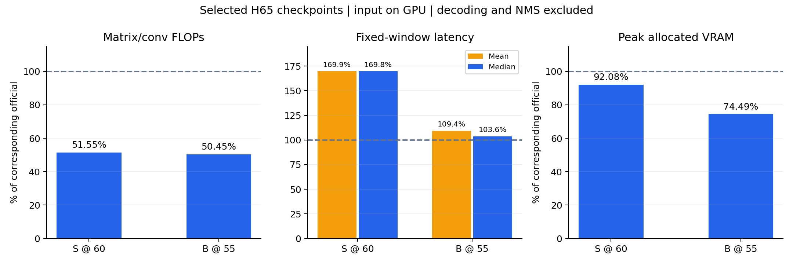

# H65保真修正完整单种子实验：最终报告

两项保真修正后，H65-S测试峰值为63.4094%（第60轮），H65-B为67.1328%（第55轮）。相同第60轮终点相对旧H65-C提高0.5501/0.2898个百分点。计算量仍约为官方一半，但指定窗口实测没有推理加速；历史H65-S的65.3857%尚未恢复。

全部200训练视频、211测试视频/792窗口；固定seed3407。S/B均从识别预训练完成20轮预热＋40轮联合，共12000次正式更新。官方只复用此前已完整评测的提供检查点，不重新训练。本轮不加入独立均匀基线、内部160/40划分、原时间检测或粗细融合结构。

按用户要求，分别在总25/30/35/40/45/50/55/60轮完整测试EMA，按平均mAP峰值选模、同分取早轮。全部16次评测已完成；这是测试集选模，不能称为独立未见测试性能。第60轮另行保留。

| 骨干 | 选模 | 平均mAP | @0.5 | 相对官方(pp) | FLOPs/官方 | FLOPs降幅 |
|---|---|---:|---:|---:|---:|---:|
| S | 第60轮 | 63.4094% | 66.3798% | -5.6032 | 51.5488% | 48.4512% |
| B | 第55轮 | 67.1328% | 70.6501% | -3.9952 | 50.4499% | 49.5501% |

官方参考平均mAP为S69.0126%、B71.1280%；选中H65分别保留其约91.88%/94.38%的平均mAP。这是观测比例，未新增90%等验收门槛。

| 骨干 | 旧H65-C第60轮 | 修正后第60轮 | 相同终点变化(pp) | 修正后测试峰值 | 峰值额外收益(pp) |
|---|---:|---:|---:|---:|---:|
| S | 62.8593% | 63.4094% | +0.5501 | 63.4094% | +0.0000 |
| B | 66.6128% | 66.9026% | +0.2898 | 67.1328% | +0.2302 |

B的峰值相对旧终点共提高0.5200个百分点，其中0.2898来自相同终点的观测变化，另0.2302来自本轮测试峰值选择；不能把后者都归因于模型修正。两项修正一起应用且仅一个种子，未分离各自贡献或证明统计稳定性。旧BMCR-T未按新配方重训，不能据此建立与本轮H65的配方匹配机制对照。

60轮课程的判断：S第55至60轮仍提高0.3261个百分点，但B在第55轮达到峰值后，第60轮下降0.2302个百分点。当前数据不支持统一断言“S/B都因60轮不足而掉分”。S仍有末段上升，单独比较更长课程有价值，但不能预先保证收益。

历史S为30预热＋60联合，固定终点65.385724%；其历史总60轮日志值约64.40%，晚期已取得曲线峰值约65.65%。本轮S终点距历史90轮终点仍1.9763个百分点，距历史总60轮日志值约0.9906个百分点。历史总60轮处在另一套30+60课程中，不能把它视为本轮20+40的等价时点。

本轮确实修复了错误LR身份分组与裁剪伪端点监督，但没有恢复全部历史分数。因此这两处缺口不能解释完整的历史差距。历史65.39对应42dba3f的global-TIA192，与当前相同；rank检测/K384也为共同机制。不要重新归因于已排除的“局部TIA换成全局TIA”、TCN改ASFormer或无关诊断分支。历史数字沿用已取得的原始回执/日志，本轮没有重新评测历史90轮模型。

若下一轮专门验证课程压缩，应在训练前锁定20+40与30+60对照，固定模型、目标、输入、数据和种子，显式登记LR与课程时间轴的映射；优先比较固定终点，峰值候选数量与取样规则也预先固定。本轮没有临时加训至90轮。原时间检测/粗细融合以及BMCR增量应在这个已明确的修正基线上单独开展，避免将课程变化与新结构一起归因。

| 骨干/检查点 | GMAC | 矩阵/卷积GFLOPs | 平均/中位时延ms | 时延范围ms | 峰值显存GiB |
|---|---:|---:|---:|---:|---:|
| S官方参考 | 1173.9470 | 2347.8940 | 51.21/51.17 | 51.12–51.71 | 0.9354 |
| S第60轮(峰值/终点) | 605.1551 | 1210.3102 | 86.98/86.89 | 86.11–89.17 | 0.8613 |
| B官方参考 | 4041.0774 | 8082.1547 | 118.31/118.17 | 118.13–119.89 | 1.5080 |
| B第55轮(峰值) | 2038.7202 | 4077.4405 | 129.39/122.47 | 121.65–253.66 | 1.1233 |
| B第60轮(终点) | 2038.7202 | 4077.4405 | 123.38/123.24 | 122.82–125.97 | 1.1233 |

计算口径为实际执行的矩阵/卷积FLOPs=2MAC，包含12层融合注意力QK和AV，逐元素运算、softmax等排除并在profile中列出。完整窗口的重型输入由官方48个16帧块减少到24个，是真实骨干执行减少；没有做空间或深度跳算。修正前后的H65矩阵MAC相同。

时延为RTX4090独立作业中的同一完整窗口：video_test_0000007、起点0、768候选、batch1，输入已在GPU；BF16骨干/scout、FP32检测器，5次预热后保留20次同步计时。已核对完整/部分/短窗三种案例与官方参考的几何、输入形状、精度一致，且无标记为未解决的矩阵算子。官方与新模型使用不同作业/节点，时间对比有相应限制；这里不包含解码和NMS，也不是全测试集平均端到端时延。

B第55轮有一条253.66ms长样本，全部20条保留，故平均129.39ms高于中位122.47ms。即使看中位数，S/B选中模型仍慢于对应官方参考。旧H65-S的92.84ms均值也含长样本，其86.67ms中位数与本轮86.89ms接近；不能把均值下降解释为此次修正实现了算法加速。当前未做分模块计时，不能定量把额外时延归到某一模块。

所有16次完整预测、每阈值指标和验证记录见[中间测试总表](INTERMEDIATE_RESULTS.md)。选中模型与终点路径见[模型选择清单](SELECTED_CHECKPOINTS.json)，未舍入比较见[FINAL_COMPARISON.json](FINAL_COMPARISON.json)，验证结果见[FINAL_VALIDATION.json](FINAL_VALIDATION.json)，12000次训练更新与保留检查点见[训练完成记录](TRAINING_COMPLETION.md)。大型权重保留在独立远端实验目录；清单给出相对路径和state_dict_ema键。

本轮训练、全部测试、峰值选择、峰值/终点测量及汇总均完成。远端控制器完成24个阶段后正常退出，无需重启或补训练。
