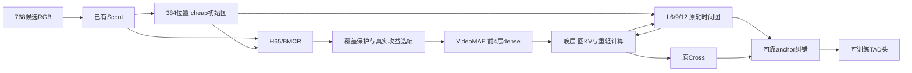

# Graph TAD 已实现结构与验证范围

2026-09-14，独立工作树graph_tad_20260914，分支codex/graph-tad-20260914。原support_review_20260914模型和原版AdaTAD对照保留。

|配置ID|轮次|实现|
|---|---:|---|
|graph_repair_s_seed42|80|当前encoder＋128D原轴时间图＋可靠anchor纠错|
|graph_context_s_seed42|80|晚层真实稀疏KV访问，保留当前Cross|
|graph_full_s_seed42|80|图KV＋L6/9/12时间图反馈＋图上下文选帧与覆盖保护＋原轴修复|
|graph_full_b_seed42|80|同上，VideoMAE-B|
|graph_fixed_local_s_seed42|40|G-Full的固定局部拓扑控制|
|graph_no_referral_s_seed42|40|G-Full的无两跳referral控制|
|graph_full_kv_s_seed42|40|保留G-Full时间图、选帧与恢复，用full-KV替代图KV|

36个阶段包括7个技术检查、7条训练、7个终点online评测、7个epoch40图诊断，以及G-Full S/B各4个固定预算完整评测。里程碑EMA全测在训练allocation内执行。主课程10/20/40/60/80，机制课程10/20/40且采用80轮LR前缀。没有性能门槛或多种子扩张。

## 实现边界

`edge_ops.py`保存每节点16个目标索引及可微权重，有限候选内进行归并、两跳地址更新、按图权重与内容共同评分。索引本身离散，保留权重有梯度。每次referral至多4×4条组成路径，正式默认2次；不构建N×N相似度矩阵。16个访问地址在query heads间共享，各head仍有自身Q/K/V内容权重。这是GM启发的视频适配，不是原Qwen多边通道模型的照搬。

图KV只替换原block ID4/6/8/10（从0计数），保持既有8×H×W packed attention域；在160分辨率为800个节点。前4层、交错dense层和末层保留。K/V投影一次后按索引读取，Q按实际admission计算。当前A-MoD前层attention分数仍计算并计费，不声称已经消除了重复打分。

训练前5轮图attention混合系数为0/.25/.5/.75/1，推理使用纯图访问；训练发生的双分支计算写入真实trace。主训练开始前的GPU技术检查使用最终图路径的完整训练窗口及两个实际更新，独立检查所有图参数组与关系权重的梯度。预检状态丢弃，正式课程从固定资产重新开始。

时间图为[B,384,128]，具有真实时间、有效性、观察质量及融合深度元数据。G-Repair在末端融合heavy后进行3次图更新；G-Full在L6/9/12更新，并用零初始化投影反馈至heavy特征。没有将池化Scout伪装成5×5空间观测。

来源写回使用每个真实contributor的原candidate-pair坐标，不使用packed native下标。非连续两帧形成的tubelet可向两个原查询位置投票，宽跨度/不足贡献/少算状态降低权重。最终输出是原Cross结果加图残差和有界、带可靠性权重的anchor纠错。新输出/反馈映射从0启动，相关输入和隐层非零；测试确认同support、图attention系数0时旧backbone输出保持。

G-Full初始图在重encoder前由已有Scout建立，提供rate residual及frame gain网络的额外384D关系上下文，后者使用真实干预标签训练。启用现有plan-aware frame condition。32个有效时间分区各保留至少一个真实观察，后续候选交换保持此约束。没有用未计算的heavy特征决定本次初始选帧。

预算菜单的0号入口保留普通Full-V2完整分支，同时作为shared-full教师；其余图入口执行对应图模型。frozen same-support教师与官方dense成本参考也保持普通计算。由此，涉及0号入口的干预比较的是完整预算策略（包括图分支启停），不能单独归为纯T/D/S因素。独立图机制对照和固定非零预算评测负责机制归因。

## 学习与成本

复用已有GT、边界加权latent、external teacher、shared-full self-KD及same-support监督；只新增可靠anchor一致性项（权重.02）。图权重获得任务/恢复梯度；actual intervention重新执行完整student，监督包含图传播效果的真实计算收益，不把入度当作收益标签。

新图模块按家庭使用由seed42确定的初始化序列，防止关闭KV模块时意外改变时间图/选帧网络初值；这些是同一个seed42实验的模块初始化，不是额外种子实验。所有新参数进入原learned-state、EMA和优化器。运行时图状态仅属于当前前向，不跨视频、调用或checkpoint遗留。

实际算子计数包括图投影、几何评分、referral路径乘积、稀疏QK/AV、heavy/light FFN、TIA、图反馈/恢复、scout/router/head。账本与真实计数逐项比对。排序/归并/索引等非矩阵操作保留在操作与耗时范围说明；不能用KV访问比例估计全模型节省。

## 已完成验证

- 10项Linux CPU测试通过：稀疏/稠密值和梯度；重复地址；padding；跨视频隔离；两跳新地址；真实来源坐标；target stop-gradient；覆盖约束；真实upstream ViT前向/反向及MAC账本；晚层carrier与零混合系数初始化。
- 7个配置全部使用实际H65/BMCR、Cross和官方head资产构建成功，优化器无遗漏/重复，learned-state严格重载成功。
- 200训练、211测试、792窗口保持一致；真实完整测试输入为[1,3,768,160,160]。
- 独立只读代码复核未确认新的正确性缺陷。反馈reshape中的b为packed clip批量，B×A=(B×K/16)×8；多clip耦合测试已验证该映射。

以上不等于GPU检查通过或图模型已有mAP。实际部署状态与job ID写入registration.json及STATUS.zh.md。新的图拓扑/可靠性可视化与同checkpoint、固定selection和D/S masks的full-KV诊断已作为阶段登记；图6机制比较只在完整结果存在后生成。

双向连线表示按层顺序发生的有限读写。原16候选clip选择路线继续取消；本方法的内部16帧计算包与16个图访问地址都不表示恢复那条路线。
