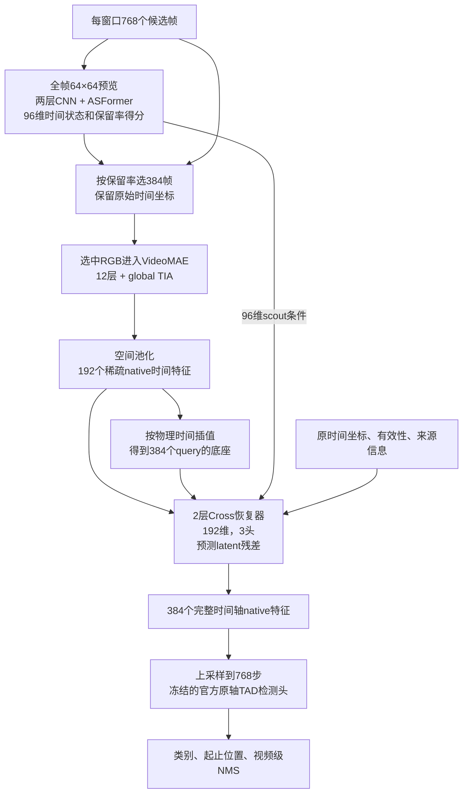

**当前模型结构、稀疏训练方式与学习选帧论证（源码复核，2026-09-13）**

本报告描述实际代码与已注册配置，不把建议写成已完成实验。14:21:33远端核查：FPW 62阶段完成、8评测排队、448等待，11/66条训练完成；BMCR 23阶段完成、1评测排队，两条80轮训练完成。控制器均健康。代码复核没有改变模型、训练配方或作业。

**1. Cross是什么；当前主模型如何连接**

这里的Cross是本项目R03中`FullAxisDecoder(kind='cross')`的简称，来自cross-attention。它是自建的原时间轴latent特征恢复器，不是另一个完整视频backbone或某篇名为Cross的现成方法。

以下为标准K384、160分辨率的S/B路径。S的特征维C=384，B为C=768。

384张入选帧按VideoMAE的16帧输入规格打包成24个计算块；这只是计算打包，不是被取消的16帧clip选择路线。tubelet时间步长为2，每块产生8个native时间位置，因此得到192个anchor。原768候选帧按原始相邻对产生384个query位置，恢复后的native特征再按既有接口插值至768步给TAD头。

入选帧会重新配对，例如一对anchor的两个来源可能在原视频中并不相邻。因此192个anchor不是dense teacher的384个特征直接抽子集；它们由选中RGB重新编码得到。decoder保留两名贡献帧的原时间、跨度、有效性与计算位置，避免把选后排序坐标当成均匀真实时间。

“缺失”的主要是未选帧的昂贵VideoMAE特征。scout仍观察全部768帧的64×64预览，因此这是一种有低成本全时轴条件的特征恢复。它没有宣称完全不观察未选帧，也不生成缺失帧的RGB像素。

实际帧选择与空间/深度选择使用不同机制：H65/BMCR的帧得分来自scout；先对得分做5点平滑，用sigmoid阈值校准使保留率总和为K，混合5%均匀覆盖率，再按累计保留率进行固定预算系统采样。BMCR先形成候选集合，再加入最近相反成员的条件效用修正重新采样。空间/深度的attention top-k不是这一步的帧采样器。

证据：[reader.py](../../h65/frame/reader.py) L29–87；[geometry.py](../../h65/frame/geometry.py) L16–45；[scout.py](../../h65/scout.py) L38–57；[full/scout.py](../../h65/full/scout.py) L20–98；[transport.py](../../h65/transport.py) L36–102。

**2. Cross内部设计；恢复器是不是decoder**

本项目里可以把恢复器称作latent decoder。“恢复器”描述功能，“decoder”描述实现。R01是非参数插值恢复；R02、R03、R06是不同的可学习decoder。它们输出的是检测特征，不是RGB视频。

R03先构造物理插值底座B，再构造query和memory：

\[
B=\mathrm{Interp}_{physical}(A),\qquad
Q_0=W_bB+W_sC_{scout}+W_qM_q,\qquad
M=W_aA+W_mM_a.
\]

其中A为192个稀疏anchor，B/Q有384个时间位置；scout条件每位置96维，query元信息8维，anchor元信息10维。S/B都投影到192维。每个Cross block为：

\[
Q'=Q+\mathrm{CrossAttention}(\mathrm{LN}(Q),\mathrm{LN}(M),\mathrm{LN}(M)),
\qquad Q_{next}=Q'+\mathrm{FFN}(\mathrm{LN}(Q')).
\]

共2层、3个attention heads，FFN中间宽度为4×192。query读取anchor memory，query之间没有self-attention，memory也不在这两层中迭代回写。最终输出

\[
\widehat F=B+W_{out}Q_2.
\]

输出头权重和bias均零初始化，所以初始预测严格退化为插值底座，然后学习残差。R03默认仅训练decoder，冻结已有scout、VideoMAE/Adapter和原轴TAD头。检测头权重冻结，但检测loss对输入特征的梯度仍传回decoder。

主监督是完整原时间轴dense teacher特征的SmoothL1加0.05×cosine距离，以及直接检测GT loss。特征距离有合法GT边界加权：靠近真实边界的位置权重更高。R04仅将直接检测GT loss的权重设为0，仍保留TAD教师和GT边界权重，不能据此推断无需GT。

R02使用240维、2层depthwise时间卷积+FFN，替代Cross attention，作为规模接近的便宜恢复器。R06复用官方VideoMAE的encoder-to-decoder投影、mask token、4层Transformer块与norm，替换原RGB head和固定patch网格位置，输出同样的latent残差。R06-S为192维/3头，B为384维/6头；把anchor memory与query拼接后做self-attention，与R03的query→memory cross-attention结构不同。R06有同结构随机初始化与官方权重初始化两组，目前仅技术预检通过，尚无正式性能结论。

当前Cross位于空间池化之后，恢复的是时间轴特征；它不逐patch恢复被跳过的空间细节，也不把恢复结果写回VideoMAE中间层。

证据：[decoder.py](../../h65/frame/decoder.py) L6–47；[model.py](../../h65/frame/model.py) L16–83；[objectives.py](../../h65/frame/objectives.py) L5–47；[mae_init.py](../../h65/frame/mae_init.py) L43–74。

**3. 当前空间选择与深度路由怎么做**

标准输入160×160、patch16，对每个native时间位置有10×10=100个空间token。一个16帧计算块有8×100=800个时空token。以下dense均指所选帧构成的计算网格，不自动表示K768全候选帧。

上一dense层的incoming attention对所有有效query和所有head求平均，给每个key token一个分数：

\[
s_j=\frac{1}{H\,N_{valid}}\sum_h\sum_{i\in valid} \mathrm{softmax}(Q_hK_h^T/\sqrt{d})_{ij}.
\]

该分数detach，不增加可训练的空间/深度router，也不乘到输出特征上。由于SDPA不直接返回attention map，实现复用投影Q/K分块重算路由分数，额外QK已计入总FLOPs。Adapter训练会间接改变后续attention分布，但当前没有直接任务效用监督的空间/深度score网络。

|路线|打分与配额|真实重计算|未获重计算的位置|
|---|---|---|---|
|S02 token48|第2/4/6/8/10层，逐native时间位置在100个空间token中取48%|这些层仅压紧heavy FFN；attention仍完整|走C→32→C的轻MLP；其输出层零初始化|
|S02 tile48|同上，先对2×2 patch的4个分数取均值，再按tile配额选取|结构化heavy/light FFN|未选tile的token走轻MLP|
|S03 query50|在指定层按整个计算块token序列选50%的Q|selected Q、full K/V；该单独支线FFN仍完整|不获得该层attention残差，保留其他状态更新|
|S01 resolution128|选中RGB由160缩至128，网格变8×8|每层空间token数都减少|此路线不另设attention top-k空间router|
|D02 A-MoD50/12.5|第2/4/6/8/10层，按每个计算块800-token序列选50%/12.5%；不是逐时间位置固定quota|selected Q/K/V与FFN都真实打包；另有full-KV控制|不获得被跳过的贵attention/FFN残差，随后仍经过完整TIA|

首层、末层保持dense；11、12层也均为dense。所有保留层的global TIA仍在完整selected-frame网格运行，标准K384的时间长度为192。空间池化仍使用完整状态网格，不会把未选空间token彻底从后续模型删除。

A-MoD默认top-k作用在时空token的深度更新上，不是删除半数层或整帧。代码中B×8的`depth_mask`仅是显式外部掩码控制，不是主attention路由的粒度。J01先做A-MoD admission，再在各时间位置的已入选token内分配48%的heavy FFN。

token48表示48%的heavy FFN容量，不是固定48个token在所有分辨率下都通用，也不是整个模型剩48%计算。由于只作用在5层、attention/TIA等继续执行并存在路由开销，已测S/B相对Cross的总FLOPs节省只有约4.59%/8.51%。

证据：[engine.py](../../h65/frame/engine.py) L16–53、L55–70、L95–160；[gates.py](../../h65/frame/gates.py) L4–34；[contracts.py](../../h65/frame/contracts.py) L38–54。

**4. 当前是否“训练密集、推理稀疏”**

当前主方案是“稀疏学生训练＋密集教师监督”。必须区分候选帧数量、层内token重计算和输出时间轴完整性。

|路线|学生训练时的实际执行|推理执行|密集教师/额外训练分支|
|---|---|---|---|
|BMCR80|K384；batch2内一半learned、一半uniform companion，两者都是384帧|K384 learned frame selection|反事实监督每8次更新调用稀疏EMA模型，不是官方K768 teacher|
|R02/R03/R04/R05/R06/R07|通常K384，所选帧内部完整12层；主要训练恢复器|同K384路径|训练每microbatch额外运行冻结官方K768 teacher提供native384目标|
|D02、S02等主稀疏支线|K384，训练时已经compact真实打包|同样compact|训练时有冻结K768 teacher；Adapter/decoder及适用的轻MLP参与学习|
|J01|K384/768与D1/.5、S1/.48混合；稀疏配置采用compact|按指定K/D/S执行compact|K768外部teacher；另有同一选帧集合、关闭深度/空间门的学生full分支|
|D03专门控制|K384、dense-mask计算：大矩阵完整算，再按路由mask限制残差|compact打包执行|仍有外部K768 teacher|

D03也不是先按完全dense的前向语义训练，再在部署时突然删token。训练时已使用对应的hard routing mask，只是矩阵实现形式dense，部署才改成实际压紧。低精度两种执行有实测数值差异，不能称逐位等价。

J01每个optimizer update交替K384/768，每两个update轮换D/S组合：全计算、仅深度、仅空间、深度+空间，覆盖8种组合。额外full学生分支使用同一选帧集合，K384时它仍是K384；该分支接受GT loss，并以detach特征为稀疏分支提供一致性目标。它不是另一个冻结的外部teacher，训练成本也不免费。

推理时执行的是稀疏学生及冻结TAD头，不运行官方teacher的全帧backbone。尽管输出有完整时间轴，昂贵VideoMAE计算仍只覆盖所选帧/获准token。R03 decoder训练默认20epoch、100更新/epoch、batch1累积2；每个20轮分支记录4000次外部teacher获取。推理FLOPs节省不能直接称为相同比例的训练节省。

证据：[frame_train.py](../../tools/frame_train.py) L78–114；[model.py](../../h65/frame/model.py) L32–83；[teachers.py](../../h65/frame/teachers.py) L7–33；BMCR80活动树的`h65/full/model.py` L72–109、`tools/full_train.py` L111–113。复用dense teacher工具类不表示恢复了已取消的DS3选择实验。

**5. 当前推进的路线及实际状态**

|路线组|模型设计/问题|本轮训练模块|当前阶段|
|---|---|---|---|
|B01 BMCR80|条件效用修正帧保留率，选后rank检测并回映时间|scout、条件效用、原Adapter、检测头|S/B训练80完成；S测到65、B到60|
|R01|物理插值+原轴检测头；另测旧rank头接口|无新训练|S/B完整结果已得|
|R02/R03|TCN或Cross恢复全轴native特征|decoder|Cross S/B、TCN-S训练20完成；TCN-B等待|
|R04/R05/R07|去直接检测GT、输出KD/差分、去decoder来源/scout条件|decoder|R04-S训练完成；其余多数等待|
|R06|官方4层latent decoder随机/预训练配对|decoder全体相关模块|S/B预检通过；正式训练等待|
|D00/D01|同配方dense Adapter；静态保留8/9层；PBD式按训练损害逐次删层|Adapter+decoder|等待；PBD不是token路由|
|D02/D03|A-MoD50/12.5、uniform/full-KV控制及dense-mask训练控制|Adapter+decoder|A-MoD50 S/B、12.5 S训练完成；其他等待|
|S01/S02/S03|128分辨率、token/tile重轻FFN、selected-Q/full-KV|Adapter+decoder；S02增加轻MLP|token48 S/B训练完成；其余等待|
|U02/U03|在已有帧集合上预测一次真实交换收益；local/global伙伴|294→64→2 ActionRouter+decoder|正式训练等待|
|J01|Cross+Adapter+A-MoD+空间轻FFN，混合K/D/S，shared-full约束|Adapter+decoder+轻MLP|S/B训练20完成，EMA5完整八格已测|
|J02|固定K384、D.5/S.48联合配置，加ActionRouter和shared-full约束|Adapter+decoder+轻MLP+router|正式训练等待|
|K01|K320/K256恢复；低K联合配置混合[K,384]与D/S|普通版decoder；联合版再训Adapter/轻MLP|等待|
|P01|全768帧额外80分辨率VideoMAE patch stem，原配对池化后投影96维，加到decoder条件|96维投影+decoder；stem冻结|S/B预检通过；正式训练等待|

U02/U03不是再次重训整个H65/BMCR帧采样器。它们对当前集合中的“移除一帧/插入一帧”构造候选，使用96维移除帧状态、96维插入帧状态、96维集合均值和6项描述符，预测分类/定位两项归一化收益，每窗口最多执行一个预测平均收益为正的交换。训练标签来自实际RGB重编码后的任务loss变化；推理不使用GT、dense teacher或离线oracle。local使用同16-slot cell内伙伴，该cell仍不是clip选择单位。

两处解释边界必须保留：R07的no_scout仅移除decoder的scout条件，帧选择scout仍运行；no_provenance仍保留共同物理插值底座。J02现有配置没有J01的`train_budgets`和`mixed_gates`，因此未来不能将J02−J01直接全归因于ActionRouter；需要匹配预算日程的对照。此项在本次报告中标为待补设计，未偷偷改变正在执行的实验。

C01是条件评分向量化的行为保真控制，M01/A01是测量与统计，G01是额外种子；它们不是新的encoder结构。G02第二数据集仍缺完整准备/匹配TAD teacher。配置注册不等于已运行，更不等于已测得性能。

证据：[frame_plan.py](../../tools/frame_plan.py) L9–57、L78–126；[router.py](../../h65/frame/router.py) L16–60；[shallow.py](../../h65/frame/shallow.py) L6–21；[J02真实配置](../../configs/frame/J02_joint_utility_s.json)。

**6. 如何论证学习选帧的价值**

当前已完成的是同一个R03 EMA5 checkpoint，在推理时替换选择方式：

|推理选择|S mAP (%)|B mAP (%)|
|---|---:|---:|
|已有H65/BMCR选择|64.1172|68.3052|
|均匀选择|63.9305|68.0987|
|确定性随机选择|62.1690|65.3183|

这能说明当前模型对不同选择的敏感性、均匀覆盖是强基线。它不能充分论证学习选择不可替代，因为这些decoder都在anchor选择下训练；把均匀策略临时替换进推理，会同时改变训练/测试分布。当前R03训练中帧采样器冻结，不能把结果称为新decoder与新selector已经端到端联合学好。

建议新增的最小公平训练对照如下；它们尚未作为新作业提交。本轮可复用现有强锚点，仅改变新恢复器训练的选择策略，无需重训历史warm或官方模型。

|训练选择|推理学习选择|推理均匀选择|
|---|---|---|
|学习选择|现有主线；已做EMA5控制|已做EMA5控制|
|均匀选择|待补：检验选择策略转移|待补：公平uniform-trained基线|

先保证同一强锚点/teacher、decoder结构、训练数据和增强、更新数、loss、种子及预先规定的选模范围。比较对角线回答两条完整适配后的方案谁更好，比较非对角线回答收益是否依赖特定训练选择分布。若研究之后端到端适配的最终上限，再让两种选择方案对同一组Adapter进行等预算适配，不能只给学习方案额外训练权限。

随后在K384/320/256上按实际完整GFLOPs画性能前沿，至少补主胜出方案的多个训练种子和成对视频区间；固定K不自动等于固定总成本，scout/条件router/decoder依赖均需计入。当前测试集峰值选择必须对两种方法一致并披露，不能把调参后的最好点当成未经选择的估计。

机制上同时看短事件、高tIoU、边界附近覆盖、被漏动作的最大采样间隔以及分类/定位错误。真实同K交换实验要重跑入选RGB与后续全轴恢复/TAD，验证预测收益与实际任务收益的相关性、正收益命中率及最终mAP，而不能只看attention图、重建误差或只与随机选择比较。现有约32窗口/60交换结果已经提示修复proxy与真实换帧收益的相关性较弱。

需要论证的是“在给定预算与TAD协议下，学习选择是否带来可复现、值得其成本的增益”，不是预设学习选帧必然优于均匀。如果公平适配后的uniform+恢复器达到相同或更好的计算量—性能前沿，就应承认当前新增价值主要来自完整时间状态恢复。

本次原始状态：[architecture_status_20260913.json](architecture_status_20260913.json)。有效成绩及统计依据：[最近结果报告](monitor_20260913_1224/UPDATE.zh.md)、[完整manifest](monitor_20260913_1224/manifest.json)。
