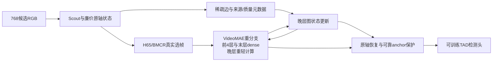

# Graph Machine 与当前 H65/BMCR 路线：优化判断和研究候选

2026-09-14。本文回答“当前模型还能怎样优化”及“如何借鉴 Graph Machine: Towards Better Pretraining via Edges”。已读取 GM arXiv v1、官方实现说明、当前代码及 16:29 远端完整评测回执。本文中的 G-Repair/G-Context/G-Full 是新研究候选，尚未实现、注册或取得结果；现有 79 配置/374 阶段继续原课程。

我的判断：最值得研究的是将“观察、状态维护、信息访问、重计算”分开。H65/BMCR决定哪些 RGB 值得进入重分支；完整低维状态保存未被重算的位置；稀疏图决定每个状态应向哪里取证；原轴恢复和可训练检测头负责输出。研究目标是提高同等总计算量下的定位精度，而不是要求每个窗口都同时压低三个轴。

## 1. 当前证据支持哪些判断

以下均为完整 THUMOS 测试的五阈值平均 mAP，seed42；80 轮课程尚未结束。成本为全测试平均 GFLOPs/窗。

|当前完整结果|mAP %|平均 GFLOPs|实际部署计划|
|---|---:|---:|---|
|Full-V2-S epoch20|64.4855|1229.323|792 窗全部 D100/S75|
|Full-V2-S epoch40|64.9949|1225.980|783 窗 D100/S100，9 窗 D100/S48|
|Full-V2-B epoch20|68.5014|3940.848|519 窗 D75/S100，273 窗 D100/S75|
|Full-V2-B epoch40|68.0518|3909.386|792 窗全部 D75/S100|
|Uniform Full-S，当前最佳 epoch20|64.5400|1226.478|D100/S100|
|Uniform Full-B，当前最佳 epoch10|68.3322|4094.316|D100/S100|
|PBD-style-S epoch10|63.7667|1131.741|尚处自身渐进删层课程中间阶段|

来源为同目录 `evidence.json` 中的完整原始记录及其远端 source 路径。Uniform epoch40 尚未收齐，不能把 V2-S40 对 Uniform-S20 的差值称为同轮次结构增益。V2-B 的当前最佳仍是 epoch20，不能只看终止时最近一次评测。S40 的高分伴随 98.86% 窗口放开 D/S，因此它支持继续研究完整系统，但并不证明三轴同时稀疏已经有效。B40 精度与深度分配一起变化，不足以单独归因于 D75。

当前原版 Native AdaTAD K384 的 S/B 评测仍为 PENDING（1289969/1289968）。该对照会回答相对原版直接降采样及其 80 轮适配的收益，不能由 Uniform Full 代替。

## 2. 先处理有证据的成本和设计问题

在 epoch20 同一个代表完整窗口，S 的空间 S75 路由节省重 FFN 45.2985G，却增加额外路由 QK 47.1859G；加上轻分支后净增加 2.8458G。B 同类对照净节省 84.8846G。`h65/paper/engine.py:18–24,119–124` 已经只在下一路由层需要时收集分数，不能把“仅在需要时打分”当作未实现优化。进一步候选是融合 attention 与路由统计，或采用新的稀疏打分方式；前者只有数值、路由 mask、输出及梯度均符合约定才能作为保持语义的优化，后者属于新模型。

Cross decoder 的代表窗口成本只有 S 1.007G/B 1.262G，分别约占完整模型 0.082%/0.031%。来源：`review_5485/monitor_20260914_1403/profile_sources.json`。因此图恢复器的首要价值是改善状态和 mAP；主要省算应来自 backbone、FFN 与路由/交互成本。不能把 decoder 的局部加速包装成全网络的大幅省算。

现有模型已经具备：前4层/末层dense、晚部交替路由、selected-Q/full-KV、depth-light、spatial-light、原轴残差 Cross、物理时间/质量元数据、外部特征教师、shared-full自蒸馏、同selected-support参考和边界加权latent损失。`model.py:47–53`还会依据mod_start重新开启实际活动层的light参数，故不能仅看encoder初始的奇数层设置而误报Full-V2轻分支被冻结。decoder的零初始化多层门控也是保护已有恢复起点的设计，不是已经证实的训练故障。

具体仍有空间：采样只有全窗 coverage floor，缺少分区覆盖保证；frame utility目前每窗只执行一次局部交换；Cross缺少显式的可靠anchor保留约束；被少算的位置虽有light更新，跨位置上下文仍受当前attention域限制。

## 3. 如何使用 GM 这条线索

主论文：[GM arXiv v1](https://arxiv.org/html/2609.02881v1)。官方实现和作者对实现差异的说明：[lintaihou/gm2](https://github.com/lintaihou/gm2)。本文借鉴其稀疏边状态、referral和稀疏读取接口，将其改写为具有物理时间、观测来源和任务收益约束的视频候选，而不是直接移植语言权重。

GM的语言输入仍逐token形成状态；我们的RGB重编码被跳过后，高质量视觉证据可能尚不存在。因此必须明确cheap观测、heavy观测和预测状态各自的来源。动态图可以改善信息访问，但不能保证重建从未观察到的动作瞬间。图路线中“保留完整轴”只表示位置和状态条目齐全，不表示每个条目都具有密集模型同等信息。

工程上须注意作者已记录的零权重槽位、温度与稀疏化先后次序差异；本任务有真实padding和无效tubelet，候选实现应明确屏蔽无效边。其训练环境与我们运行中的OpenTAD环境不同，移植应局限在新增模块；原训练器只有权重检查点，不能代替本项目的optimizer/EMA/RNG/cursor恢复机制。以上依据官方README的Implementation details、Installation、Logging and checkpoints。

## 4. 面向 TAD 的节点、边和真实计算

### 4.1 时间图：最小且清楚的状态载体

首先定义 `C[B,384,128]` 的原轴时间状态，来源于全轴Scout特征的投影以及已计算heavy anchors。它是一条新候选中的低维时间状态，不代表真实完整高维encoder特征。

每个节点携带物理时间、有效性、最近真实计算层、观察/预测来源和估计质量。图边至少区分局部连续性、远程语义访问和真实anchor取证三种用途。离线TAD可双向连边；流式变体才施加因果方向。预设局部/多尺度联系用于保证可达性，再通过有限候选中的可学习边更新选取远程联系，避免每层先计算全体节点两两相似度再声称稀疏。

只有有限referral步时，“潜在有全局通路”不等于“任意远程信息已被检索到”；需要测有限步数下的可达性和实际访问分布。

### 4.2 空间图：必须另算真实的网格成本

空间扩展应定义 `C[B,384,5,5,128]`，即每个窗口 9,600 个节点，而不是把它当384个节点。节点需要真实的低分辨率空间特征来源。当前已池化的96D Scout时间向量，不能通过expand变成含有5×5空间细节的特征。

重分支保留高价值patch的原MLP；其他patch可用低维图消息加轻残差更新，避免完全隔断上下文。图邻域保留局部几何连接，并允许少量远程联系。该扩展会增加cheap空间前端、投影、边更新、gather/scatter及消息计算，必须在完整FLOPs和访存报告中体现。

### 4.3 恢复器保留来源一致性

当前一枚selected tubelet可能由两个不连续采样帧组成。写回必须依赖 `contributor_times / valid / span`，不能把packed下标当成原384轴的精确下标。

可以研究质量条件残差：可靠的heavy证据只接受受控修正；缺失或低质量位置由图状态和Cross联合补全。已有Cross就是“插值底座＋残差”，所以仅把feature loss改写为“预测target-base的残差”并不天然是新机制：对于同一逐点差分项，这只是代数重写。真正新问题是来源一致性、质量门控、拓扑和关系约束。

### 4.4 图关系与真实计算收益各司其职

连接多或attention权重大不等于值得新增重计算。图可以提出需要取证的位置，而已有actual intervention机制检验新增该帧/patch/层是否降低检测损失。

适合研究的任务效用为：某一次真实计算经过图传播后，为哪些原轴位置减少了可验证的错误，收益是否超过它增加的总成本。这比直接按图入度分配预算更贴近TAD。推理中使用预测效用和已有观察；teacher/GT只用于训练标签及分析。

选帧发生在重encoder之前，因此这一决策必须读取Scout/cheap初始图。后部heavy更新可以用于本次恢复及训练监督，不能在单次前向中被假装成选帧前已经可用的信息。

## 5. 三个可独立并行的完整模型候选

|候选|主改动|希望回答的问题|主要风险|
|---|---|---|---|
|G-Repair|保留当前encoder，增加原轴时间图和anchor可靠性约束，向Cross提供低维残差上下文|动态关系能否改善长gap、边界、重复动作的恢复？|整体计算可能略增；decoder省算空间很小|
|G-Context|保留前4层与末层dense及当前T/D/S配额；晚层Q只读取图选出的局部＋远程KV|能否以更少关系计算接近full-KV的状态/定位性能？|这是新的attention分布；不能称为等价实现优化|
|G-Full|结合两项，并在少数晚层（候选L6/9/12）让heavy结果修正原轴图状态|观察、状态维护、按需交互联合后能否产生更好的完整模型前沿？|增量投影/图更新或训练失配可能抵消收益|

G-Context初始可选“8个局部联系＋8个动态联系/查询”和1–2次referral作为单个明确配置；这些是待实现设计参数，不照抄语言模型的2/4个KV访问。保持Q、depth和spatial预算相同可以检查KV访问机制；更换D/S路由分数则另标为新策略。不会通过把完整KV仍然算一遍后再屏蔽，虚报稀疏成本。

少量KV访问也不意味着K/V线性投影和FFN按同一比例减少：不同查询的邻居并集仍可能覆盖所有节点。需要按实际唯一节点投影、QK/AV边数、referral和FFN逐项计费；重复按query投影同一个key甚至可能额外增加开销。保留dense层的混合模型也不能仅凭其稀疏图层的复杂度，就声称全模型对序列长度严格线性。

这些候选可以同时实现、并行完整训练；不以G-Repair的中途mAP作为G-Context/G-Full启动门槛。建议首批G-Repair-S、G-Context-S、G-Full-S/B共4个新完整答案，均seed42/80轮。当前Full-V2、Uniform Full、Native AdaTAD、PBD/Static继续作为既有控制。图机制对照主要在S上安排：同成本固定局部图、无referral图、完整动态图；可用40轮匹配主模型前40轮课程，独立排队。

## 6. 保住预训练起点与学习目标

VideoMAE encoder和当前Cross/官方MAE decoder初始化继续保留；GM语言模型权重不是这些视觉模块的可加载起点。图可先作为memory组织或新增残差接口。新增输出映射零初始化时，确保输入非零、乘法gate非零；不重置已经训练好的TIA Up。直接替换原attention则需要明示的适配课程和最终只执行稀疏分支的实现，不能因某个新投影置零就声称原函数被保持。

监督优先复用已有GT、同support状态目标和自蒸馏。当前 `h65/frame/objectives.py:5–18` 已经给有效GT边界附近特征更高权重，普通“加边界权重”不能再次作为创新。

新增值得对照的是关系学习：在有限候选边集合上监督哪些来源能帮助恢复，配合真实任务收益标签；必要时使用训练期teacher关系作为软目标。不要把所有dense attention细节强迫复制进一个稀疏图。边权可以从检测/恢复梯度学习，硬目标索引的探索仍需要refresh或候选变更机制；不能把top-k选址描述成对所有未选地址都有普通梯度。

同支持teacher主要约束“观察不变时少算D/S”的误差；原轴teacher/自蒸馏约束“有些时间位置未被重观察”的恢复。两种监督的时间支持和作用不可混淆。

若进一步做视频自监督适配，可只使用训练划分的RGB，构造不同T/D/S缺失模式，让图帮助预测另一个分支的stop-gradient latent。应将其称为新增域内适配，不用现有THUMOS规模的实验冒充大规模预训练。继续保留no-external、recognition-only等对照以衡量密集任务教师依赖。

## 7. 一次实验应留下什么科学证据

核心仍是完整模型mAP–GFLOPs前沿，同时展示最佳和epoch80。图方法必须对照Native uniform、Uniform Full以及PBD/Static；S/B一起看跨骨干绝对成本，不能仅显示对各自dense模型的相对比例。

机制证据可以集中为四张图：

1. 相同计算下，固定局部图、无referral、动态图、full-KV的性能及同support状态误差。
2. 原物理时间/空间上的边连接与有限步数可达性，同时标出可靠anchor、缺失位置、padding和GT边界（仅可视化时使用GT）。
3. 对长gap、短动作、动作交界、重复动作分别报告恢复误差与AP；语义边可跨实例取上下文，边界传播要避免把两个同类动作粘成一个。
4. 预测计算收益与实际intervention收益的校准，以及边更新、referral、QK/AV、heavy/light FFN、TIA、decoder、head的完整成本分解。

只降低latent误差、只降低KV访问数或只画少量漂亮边图，都不足以证明TAD有效。减少图referral开销与保留边界信息之间的关系本身就是值得回答的科学问题。

## 8. 新颖性与实验室扩展

“在TAD里使用动态图”已有先例：[G-TAD](https://openaccess.thecvf.com/content_CVPR_2020/html/Xu_G-TAD_Sub-Graph_Localization_for_Temporal_Action_Detection_CVPR_2020_paper.html)采用时间和语义关系、动态更新边。[TadTR](https://arxiv.org/abs/2106.10271)的temporal deformable attention已进行稀疏关键位置访问。[PBD](https://openaccess.thecvf.com/content/CVPR2025/html/Chen_Temporal_Action_Detection_Model_Compression_by_Progressive_Block_Drop_CVPR_2025_paper.html)研究渐进删层与恢复。因此论文应把贡献落在：未重观察状态与少算状态的区分、具有物理来源/质量的持久稀疏关系、真实计算对整个原轴状态的纠错收益，以及验证后的完整网络前沿。H65/BMCR/Cross和Carrier-TIA均为内部作者方法。

实验室长期可共享同一套“节点—边—真实计算”接口，探索以下新任务，而不是立即扩大当前训练队列：

- 长视频多任务：TAD、文本时刻检索、密集视频描述共享全轴状态，不同任务查询不同的证据关系。
- 流式视频或跟踪：检验状态年龄、观测可靠性和有限访存下的目标持续性；流式时单独定义因果边及内存淘汰，不能沿用离线双向图。
- 音视频或多传感器缺失补全：以真实时间戳建立跨模态边，区分真实测量与预测值，评估异步和失效输入下的任务误差。

这些是迁移假设。一个可复用的关系模块只有跨任务收益与全成本一起成立，才有资格上升为实验室的通用模型路线。

## 9. 候选结构图

图为拟议G-Full；D与F之间的双向箭头表示按层顺序进行的读写，而非无界迭代。当前已运行Full-V2仍为末端Cross恢复结构。本轮只做研究判断、证据归档和候选规划。
