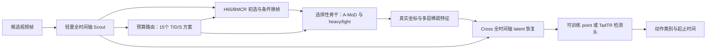

**当前论文故事、模型结构、证据与初始化依赖复核**

依据：2026-09-13 22:37:14 +0800 远端只读快照、当前 paper 源码与历史完整测试。当前阶段每个完整配置仅 seed 42 一次；本报告不改变实验配置或队列。完整新 paper 尚无训练更新/完整测试，8 个新作业 PENDING；47 条 FPW 与20条 BMCR80完整测试是历史证据。

最合适的论文定位是：**在计算预算约束下，通过选择性真实计算与全时间轴任务特征恢复，维持时序动作定位所需的状态。** 当前最成熟的证据来自时间稀疏与恢复；真实任务收益驱动的三轴联合分配已经实现，但尚未得到完整新模型结果支持。当前方法也明确继承强任务模型参数，并依赖额外训练监督，不能描述成从普通预训练直接得到、无需稠密任务模型的低成本训练方法。

**任务与科学问题。** TAD从未裁剪长视频输出多个动作的类别、开始/结束时间与置信度。高重复率意味着部分计算可以被替代，但边界附近的小变化、短动作和背景中的少量线索可能对定位非常重要。“两帧相似”“相邻patch相似”“两层特征变化小”只能描述表征相似，不能直接证明删掉它们不损伤TAD。

需要回答三个问题：第一，稀疏观测怎样仍向检测头提供坐标正确、时间完整的特征？第二，哪些额外真实计算能够降低分类和定位损失，特征预测误差能否代表这种收益？第三，减少时间、空间或深度计算后，其他维度的可替代程度是否改变？论文中的冗余应是相对于任务、预算、已有观测和模型状态定义的可替代计算，而非视频的无条件固定属性。已有结果只表明特定模型及预算下的交互，尚未建立普遍定律。

**实际模型流程。** T/D/S 是同一骨干上的三种计算控制，不是三个完整网络并行推理。

时间：Scout廉价查看完整候选时间轴，H65/BMCR产生初始选帧，FrameRouter预测换帧的分类/定位收益和不确定性。当前每窗口最多接受一次预测保守收益为正的局部换帧；它不是每个位置均可反复补算的迭代策略。768、384、320、256是帧预算，16帧只是骨干内部计算打包，不恢复已取消的原clip选择路线。

深度：交替A-MoD层，首层末层dense，用前层attention排序；选中的token做真实压缩QKV/FFN计算，未执行的token保留已有状态，并保留全局TIA。D=.5表示相应路由层的token计算配额，不表示整个网络删去一半层。

空间：在深度接纳的token范围内分配heavy FFN和light FFN；省下的是重更新计算。当前attention排序不是从GT得到的空间重要性oracle，也不保证选择到动作主体。深度跳过和空间轻更新不是同一操作。

恢复：默认是自建两层、192维、3头的Cross latent residual decoder，不是直接调用官方VideoMAE像素重建头。以真实时间坐标的插值特征为基底，加上Scout上下文和来源信息，再从稀疏memory预测残差。多层版本将1/2、3/4及最终层特征经投影和可学习门融合进memory（12层为6/9/12，24层为12/18/24）；这不是为每层各运行一个decoder。Cross块没有query self-attention。输出是供TAD使用的时间特征，不是RGB，也不是恢复所有层所有空间token的完整三维张量。

THUMOS标准768候选帧、K384时，tubelet后192个稀疏native状态，经恢复得到原轴384个特征，再由readout适配到768检测位置；ANet对应完整特征/检测轴另行映射到192。时间轴完整表示每个检测位置都有特征，不代表缺失信息得到了无误差重建。

任务学习：默认独立student检测头可训练，连同Adapter、Scout、Cross、light、frame/budget router更新；ViT主干参数默认冻结，另有full_finetune对照。独立student head的意思是参数与teacher分离，不代表随机初始化。训练包含稀疏计划、shared-full student、GT损失、外部特征KD及真实动作收益监督。当前不属于只用稠密状态训练后突然在推理删token，但训练会额外执行完整student/teacher，因此不能据推理FLOPs推断训练也更便宜。

预算路由：根据Scout上下文从15个离散T/D/S方案中，在实际完整模型FLOPs约束下选择预测收益较高、风险较低的方案。监督标签为改变预算/换帧后重执行当前student、TIA、decoder和head所得的分类/定位损失差；不是用teacher特征替换所产生的收益冒充真实计算收益。部署只使用预测，不需要GT评分。当前动作价值来自可微任务损失而不是直接mAP，其排序对最终mAP的价值仍须验证。

实现的范围限制：预算在骨干之前由Scout决定，恢复在后面执行；尚未实现“解码后定位最危险误差，再循环请求真实计算”的闭环。当前可表达有限全局配额与局部换帧，不是任意层、任意token的全局最优预算分配。

**拟贡献与已有工作的边界。**

第一项候选贡献是为TAD构建坐标与来源感知的完整时间状态，使昂贵骨干只处理部分观测，而检测头仍在原轴工作。需要以坐标/来源、多层memory、插值/TCN/MAE对照证明具体机制。

第二项候选贡献是以真实任务损失差学习计算动作的价值，区分特征修复代理和实际重执行，并在计算约束下用收益与不确定性选择联合预算。需要证明预测排序、预算利用和TAD表现优于静态菜单、随机/均匀、只用特征误差的策略。

第三项候选贡献是测量多轴稀疏的条件交互，并用混合稀疏状态训练、完整分支监督与恢复缓解损伤。已有交互是问题证据；解决交互的有效性仍是待验证主张。

不能将“稀疏编码+decoder”“latent预测”“attention路由”“联合动态计算”本身声称为首次提出。VideoMAE研究高掩码视频重建预训练：[原论文](https://arxiv.org/abs/2203.12602)。V-JEPA已有latent特征预测：[原论文](https://arxiv.org/abs/2404.08471)。A-MoD已有前层attention路由：[原论文](https://arxiv.org/abs/2412.20875)。Uni-AdaFocus已有时空/样本动态计算：[原论文](https://arxiv.org/abs/2412.11228)。本项目应证明任务状态恢复、真实计算收益与TAD三轴耦合的具体增量，当前核查也不是“已排除所有相似工作”的新颖性证明。

**目前实验支持到哪里。**

下表是THUMOS14全211视频/792窗口，mAP@0.3:0.1:0.7。GFLOPs是固定768候选帧完整窗口的完整模型矩阵/卷积计算（2 MAC），不是整视频总量，也不是训练总成本。

|模型|mAP %|GFLOPs/完整窗口|相对同骨干官方dense减少计算|
|---|---:|---:|---:|
|官方dense S|69.0126|2347.89|—|
|旧Cross-S EMA20|64.5743|1226.36|47.77%|
|官方dense B|71.1280|8082.15|—|
|旧Cross-B EMA10|68.5792|4094.12|49.34%|

Cross对当前已测修正BMCR80峰值的描述性优势为S +0.7371pp（对63.8372，epoch65）、B +0.4431pp（对68.1361，epoch70）。课程及初始化不同，不应将此称为严格单因素因果增益。历史H65-S65.3857仍高于Cross-S，其配对成本尚未核实；当前S不能宣称刷新全部历史最好。

已有Cross-S比R01插值 +0.7497pp，但此前200次视频配对bootstrap的95%区间约[-0.1252,1.5218]pp，包含0。现有结果说明恢复有正向趋势，尚不足以证明稳定显著改善。Cross-B仍比官方B低2.5488pp，Cross-S低4.4383pp；官方S在精度和绝对FLOPs上同时优于Cross-B，尚未建立全局计算—精度前沿优势。

学习选帧必须比较同一epoch、EMA状态及checkpoint。R03 epoch5 EMA：S的anchor64.1172、uniform63.9305、random62.1690；B的anchor68.3052、uniform68.0987、random65.3183。对uniform优势仅+0.1866/+0.2065pp。epoch20的“learned”字段指online权重状态，不能与epoch5 EMA uniform相减并当成学习选点增益。当前还没有匹配独立训练完整结果足以证明复杂选点必要。

三轴J01在同一epoch5 EMA checkpoint下的8格完整存在；K384/D50/S48是默认eval记录，不带factor后缀，不能误判为缺格。K384时：

|计算控制|S mAP|B mAP|
|---|---:|---:|
|仅时间稀疏，D1/S1|64.0653|68.1111|
|加空间S.48|63.3173|65.6399|
|加深度D.5|60.6001|63.1962|
|同时D.5/S.48|59.4416|60.5032|

采用t=1表示T384、d=1表示D.5、s=1表示S.48，t=d=s=0是T768/D1/S1。T×D在S1时的差分为m110−m100−m010+m000，S/B分别−1.3653/−1.7716pp；D×S在T384时为−0.4105/−0.2218pp，在T768时为−0.6907/−0.4212pp。三阶差分则为+0.2802/+0.1994pp，不能据二阶负值说所有交互都为负。数值已从原始记录重新计算到factorial_recheck.json，替代旧STATE中不一致的T×D数字。

这些结果支持“不同维度省计算存在条件依赖，简单叠加会伤害定位”，不支持“三轴都有大量无损冗余且已被解决”。新paper完整模型、独立消融、ANet、InternVideo1-MQ和TadTR结果尚无；当前只能提出机制假设。单seed42协议也不支持跨训练随机种子稳定性主张，视频bootstrap只估计固定模型的测试样本不确定性。

**对强模型参数的实际依赖。**

|部分|当前默认来源|依赖的含义|
|---|---|---|
|THUMOS encoder/Adapter/scout|H65-S与BMCR-B任务训练checkpoint|继承已学任务知识；这些锚点本身是选择性执行模型，不能全部叫dense模型|
|Point student readout|官方已训练dense AdaTAD checkpoint|参数独立后继续训练，仍继承dense检测能力|
|Cross恢复器|R03 epoch20 EMA|新paper前已有恢复课程；不是仅从普通VideoMAE预训练一步到位|
|External teacher|官方dense AdaTAD S/B|训练特征KD、repair诊断中执行；正常推理关闭|
|Shared-full student|同一个student的全预算分支|训练增加完整计算，不要求单独预先收敛教师|
|ANet S/B|官方ANet task-adapted encoder/head/teacher；THUMOS scout|继承数据集任务教师与跨数据集scout|
|InternVideo1-MQ|识别预训练骨干、新head/Adapter；继承THUMOS scout|较少依赖完整TAD教师，但并非全流程无TAD先验，且尚无结果|
|TadTR|新建query head，继承H65/BMCR encoder与R03恢复等|只去掉point-head初始化，不代表去掉其他依赖|

源码：h65/paper/model.py:18–32，encoder.py:47–51，readout.py:17–27，objectives.py:15–31，interventions.py:88–104，tools/paper_assets.py资源映射；资产实际路径见本目录live_snapshot.json的resources。

普通paper_eval以with_teacher=False建立student，predictions只执行student骨干、恢复器、head。它不需在每次预测先计算dense teacher特征。但是checkpoint目前保存learned_state，冻结主干由资源checkpoint重建，再覆盖训练参数（model.py:123–138、paper_eval.py:15–19）。所以部署加载仍需固定base资产；“不运行dense teacher”不等于“删掉所有base checkpoint文件仍能加载”，后续可导出合并后的student以解决打包依赖，不能以打包解决科学上的初始化依赖。

当前no_external只将feature权重设0。model仍按资源创建teacher并从teacher_path初始化point head；collect_action的repair仍调用teacher。因而它应解释为关闭外部特征KD的对照，不能用来证明严格无教师，更不能证明无需dense TAD初始化。frozen_encoder与full_finetune也都保留原任务初始化。

可以确认的是“当前实现路径依赖很强”；缺少对照，尚不能量化移除依赖会掉多少精度或断言必然失效。若论文定位为强TAD模型的部署压缩，这种依赖本身可接受，但必须公开训练链、教师/动作查询成本与资产来源。若要声称通用预训练起步即可低成本训练稀疏TAD，当前证据不够。

**最有判别力的补充实验。** 保持现有主路线继续，每项仅seed42一次：一是严格无外部teacher（包括repair取值），保留相同初始化，区分监督与初始化；二是只用公开VideoMAE预训练，新建head/Adapter/scout/decoder，去H65/BMCR/R03任务初始化和外部teacher，允许shared-full，检验是否需要预先训练dense TAD；三是在第二项上取消额外full分支、只训练稀疏状态并报告实际训练总成本，才检验训练效率；四是为主要性能比较保证同一数据、预训练、训练预算，并同时给uniform和dense参照。这些严格初始化对照尚未完整登记在当前52配置中，不能把现有no_external、frozen_encoder或TadTR当作替代。

本报告将当前论文主张限定为可检验的研究假设与已测阶段性事实。最终核心结果需要同时显示全模型FLOPs—mAP改善、匹配对照中的恢复/路由增益，以及三轴交互得到改善。
