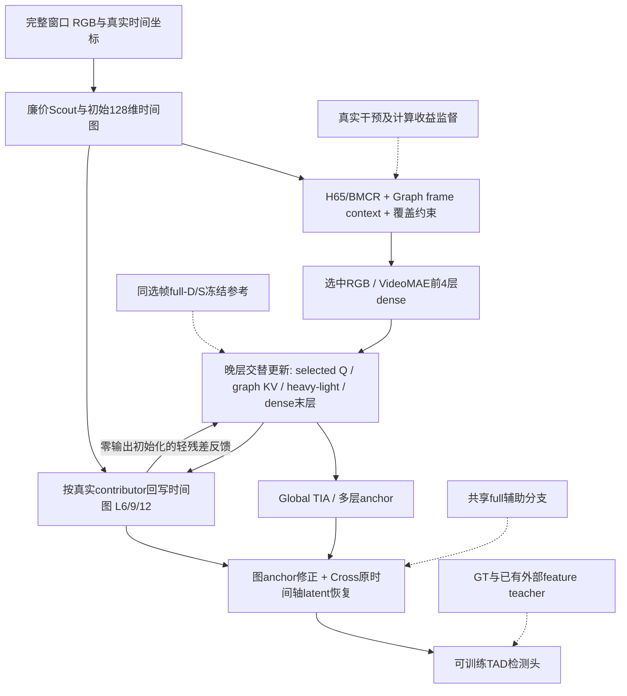

# 论文故事、证据和完整进度

**当前还不能把完整三轴Graph模型写成已经成立的最终论文结果。** 已有完整实现、多个运行中的候选、95条历史/当前全测和可重建图表；但最新Graph、原版降采样、80轮终点、多数独立消融及泛化尚未完成。工程覆盖较广，证据覆盖仍不足，不能按配置数量给“论文完成百分比”。

## 任务、问题与候选贡献

任务是从长视频定位动作类别、起止时间。在计算预算下减少昂贵RGB/ViT处理，同时维护检测器需要的原始时间轴状态。待解决的失配有两类：时间选择改变观察与时间支持；深度/空间稀疏改变同一观察上的内部状态更新。TAD尤其可能受短动作、边界和长缺口影响。

当前候选主线是“保留对定位可用的完整状态，并把真实计算用于纠正任务相关误差”：H65/BMCR选择观察，Cross/MAE类latent decoder恢复原轴；晚层保护上下文和轻残差更新减少跳过状态的退化；实际干预训练路由收益；Graph进一步用稀疏关系寻找可读证据、保护anchor并反馈时间图。

候选贡献应落在物理时间支持、可追踪的状态来源、同支持状态监督与预算下真实计算收益的联合建模。它们目前是待验证贡献，不能把“加decoder”“加图”“attention选token”本身写成已证创新。边界加权feature loss、残差Cross等已有模块也不能改名后重复主张。

## 当前证据能说到哪里

|主张|已有证据|当前判断/欠缺|
|---|---|---|
|原轴恢复允许显著少算|BMCR/Cross历史全测；当前V2-B峰值68.5014、平均3940.85G，对dense-B71.1204/8082.15G|已有精度—计算折中；仍低2.619pp，不是保持或超过dense精度|
|完整组合优于当前V1|V2-S/B各自峰值优于V1|组合级正向信号；课程尚未结束，不支持归因到单模块|
|学习选帧比均匀必要|同课程Uniform Full已测至60轮|S峰值Uniform高0.3420pp；B的V2峰值优势仅0.1692pp；原版AdaTAD K384还未测，证据不足|
|动态T+D+S优于简单压缩|PBD-S中期和少量路由分布|V2-S40的783/792窗D/S全量，60轮全部D/S全量；B主要D75/S100，尚未证明同时压缩三个轴|
|context/stale-state导致掉点|full-KV/light/late/same-support代码及10个状态课程|需要完整机制结果和匹配代价；组合差值不能确认为因果|
|Graph能维持上下文并改进前沿|真实稀疏KV/原轴状态/反馈实现，CPU与资产检查通过|GPU及mAP尚无，无法主张有效或省算|
|官方MAE decoder初始化有价值|预训练与随机同架构、fresh Cross及输入适配已注册|6个decoder控制均待跑，无结果支持预训练收益|
|不依赖完整dense任务模型|已注册无外部loss、无外部查询、无shared-full、K400起点稀疏/dense|当前正式候选仍用H65/BMCR/R03和官方任务head/teacher资产；摆脱依赖未被证实|
|跨数据集/骨干/head泛化|ANet6、MQ3、TadTR6课程及实现入口|尚无完整成绩；它们当前还是较早PaperModel配置，不能替代新版Graph泛化|
|统计及误差归因可靠|211视频配对bootstrap、候选级误差账本已执行部分|仅固定checkpoint下视频采样不确定性；不是多训练seed稳定性；mAP还涉及排序、分类、背景|

当前S的额外路由评分QK代表窗约47.19G，超过节省的heavy FFN约45.30G，说明必须看完整计费，不能只画被跳过的算子。Cross仅约0.03%–0.08%代表窗成本，替换decoder主要应验证性能贡献，不能预设它能大幅削减总计算。[分项证据](../paper/review_5485/monitor_20260914_1403/UPDATE.zh.md)

## 网络图的实际状态

已有可核对Full-V2结构图与PNG/SVG，Graph的本次结构关系如下。实线是推理数据流，虚线是训练目标；这张图表示已实现的接口，不表示Graph已经产生性能结果。

[现有Full-V2网络图](../paper/graph/monitor_20260914_1959/analysis/figures/model_full_v2.png)与[SVG](../paper/graph/monitor_20260914_1959/analysis/figures/model_full_v2.svg)已完成。最终论文图还要随最终候选统一：标明selected时间和original时间、低维状态和heavy token、训练/推理路径、稀疏KV作用域以及所有计费组件。当前还没有一张已验证成绩支持的“最终获胜Graph网络图”。

## 图表进度

|图/表|已有资产|尚需补齐|
|---|---|---|
|完整方法mAP—GFLOPs|[实测Pareto图](../paper/graph/monitor_20260914_1959/analysis/figures/fig1_complete_method_pareto.png)、[图源](../paper/graph/monitor_20260914_1959/analysis/figures/fig1_complete_method_pareto.sources.json)|原版K384、Graph、Static/PBD终点；同骨干与跨骨干前沿分开，历史Dense-S不能隐藏|
|训练过程/峰值/终点|[trajectory](../paper/graph/monitor_20260914_1959/figures/training_trajectory.png)、[60轮比较](../paper/graph/monitor_20260914_1959/figures/epoch_060_comparison.png)|80轮终点、所有候选相同milestone；不把早期峰值当最终收敛|
|T/TD/TS/TDS frontier|生成器与占位面板已存在|独立课程结果；严格核对full与axes的预算策略，不把不同checkpoint干预冒充独立训练|
|A-MoD失败诊断/状态误差|10个机制配置与同支持attention/FFN/TIA日志接口|真实检查点的逐层误差、同实际成本比较、短动作与边界分布|
|Decoder比较|Interp/TCN/fresh Cross/MAE随机/预训练/输入适配配置和绘图入口|完整结果；区分架构效应、初始化效应和参数/算量差|
|Graph拓扑和恢复|图诊断、固定KV参照、来源/质量/距离/度记录已实现|真实预检和课程checkpoint；不得用toy热图代替TAD证据|
|三轴冗余开篇说明|已有成本分项与路由统计|在匹配支持/代价下测各轴删减敏感度，结合边界/短动作/背景/重复动作，区分冗余与信息缺失|
|误差与置信区间|部分40轮配对分析完成|其余注册对照/终点；用AP、候选排序和定位错误解释，不只看漏检|

所有未测图仅能标注“待测”，不画预测点。主图突出最佳实测与对应完整计算，但完整保留dense/均匀等强参照。主结果GFLOPs使用全测试平均；局部代表窗分项另图，避免把V2-S40少见S48窗口1181G当全测试平均1226G。

## 完整论文最需要的后续结果

当前先完成已经注册的完整答案：V1/V2/Uniform/PBD/Static80轮，原版AdaTAD直接降采样与80轮适配，以及Graph四条80轮候选。资源不足时仍按优先级自动补位，不等待某条科学结论后才注册下一条。Graph/Simple能否形成超过均匀和静态控制的新前沿，决定最终方法是否需要全部组件。

机制重点是同支持full-KV、depth-light、late routing、空间保状态，以及fresh/预训练decoder、teacher依赖。T、TD、TS、TDS必须使用匹配课程和预算口径；现有七格和full主课程尚不能自动组成严格同策略八格因子表。最终选用V2/Graph时也要核对其消融是否来自同一版方法。

ANet数据完整READY后，已有泛化课程独立推进；MQ/TadTR在自身技术检查和资源可用后运行，不以THUMOS成绩为门槛。但它们当前验证的是原PaperModel。若论文最终采用Graph，应补齐对应最终配置的跨数据集/骨干/head实验，不能只换图例名字。

公开对照中，官方AdaTAD复测与原版下采样是当前最直接的完整系统参照；PBD-style必须保留“style”及配方差异，正式声称胜过论文方法还需可比的作者实现/结果口径。TadTR是本项目的head泛化测试；H65/BMCR/Cross作为内部前身/控制。外部文献reported数值和本框架复测、特征输入方法和RGB全链路成本都应分表。

**可写程度**：方法定义、实现细节、实验协议、已有折中结果和部分诊断可以形成扎实研究稿；最终创新主张、主结果表、三轴必要性、Graph机制、decoder初始化收益和跨域泛化仍不能封稿。已有结果足以支持继续检验，但不足以承诺论文录用或宣称完整路线已获胜。
