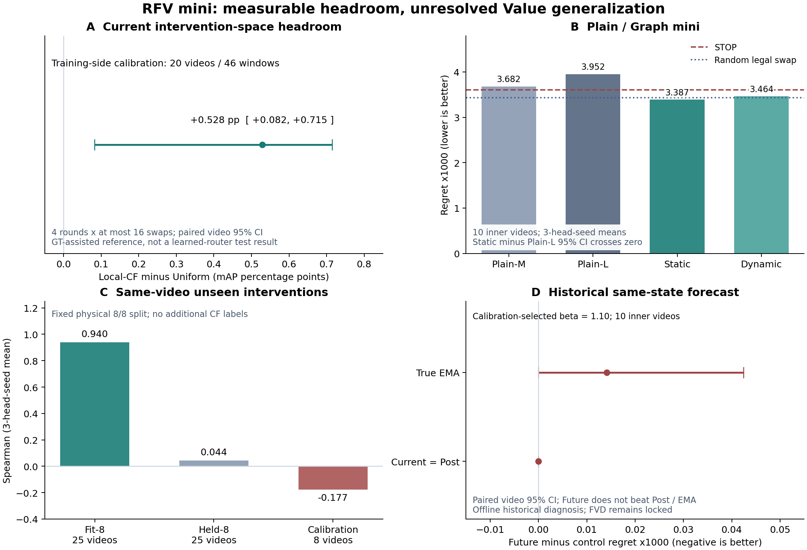

# RFV Fast Sprint：已测证据与当前安排

2026-09-15。本目录保留完整用户设计、当前协议、代码审阅、真实实验报告与启动日志。新 RFV 是独立分支，既有 D/S 的 science405 与已发布历史快照不变。主计划见 [PROTOCOL.zh.md](PROTOCOL.zh.md)，实际队列见 [EXPERIMENT_QUEUE.json](EXPERIMENT_QUEUE.json)，运行交接见 [EXECUTION_STATE.zh.md](EXECUTION_STATE.zh.md)。

| 问题 | 当前实测 | 结论边界 |
|---|---|---|
| 当前T动作空间有余量吗？ | cal20全部46窗，LocalCF−Uniform +0.5284pp，配对视频95% CI [+0.0824,+0.7147]pp | 是；仅训练侧GT辅助参考，不是learned router或官方test |
| Plain是否学到可泛化Value？ | mini内层PlainM regret .0036817，STOP .0036001；同视频8/8 held rho .0444 | 尚无稳定泛化证据，不能只归因于跨视频样本少 |
| Graph是否优于同信息Plain-L？ | Static−Plain-L regret CI [-.0012700,+.0000951] | mini G1未过；不是对全部Graph方法的否定 |
| actual Value是否漂移？ | 固定动作20→60 rho .7764，TopK .7267，符号翻转14.39% | 历史漂移已测到；不等于能预测或能改善任务 |
| 同state外推是否改善选择？ | β1.1；Future与Post regret相同，略高于真EMA | 历史B0未过，FVD保持未解锁 |

`evidence/`保留完整JSON与独立审阅。G0b报告旧字段`task_course_eligible`仅编码headroom前提；它不能授权正式训练，新版分析已改名`headroom_gate_passed`。旧G1报告`state_count=30`为10个state×3seed评估行，统计单位仍为10个视频；旧STOP NDCG来自任意tie排序，不代表STOP有排序能力。这些解释不修改原数值或原始报告。

固定CPU descriptor诊断也已完成，使用已保存seed42头的fit8归一化、原物理8/8划分、state内full407精确碰撞与标准化欧氏近邻，比较近邻gain差和同state随机配对，以state内置换和video bootstrap作参照。25个state/200近邻无精确碰撞；归一化gain差相对随机−.006311，video95% CI[−.029751,+.020092]、p=.334；异号率51.0%对50.875%。零新训练、模型前向和CF/GPU查询；没有产生NN router或调距离/阈值。

只有精确相同输入却出现超出replay噪声的不同标签，才直接反证输入可辨识性。没有碰撞不证明信息充分；当前固定度量未检出局部一致性也不能证明所有函数不可学。下一步先论证一个有具体因果理由的最小Value学习或状态表示修订，独立讨论后再登记同数据/预算的Plain对照；不重复这次诊断、不扩展变体矩阵。32→64扩展尚未满足先前条件。

所有正式课程仍按headroom、Plain可学性和完整recipe技术准入共同决定。通过后直接匹配80轮、边训边测，epoch80永久primary。GCTX/FVD各自通过后才进入四格。Atlas-S停止GPU扩张、B暂停；4090现有D/S继续。当前尚不能宣称最终模型完整可行，台账全部Final=no。

图A为G0b的视频配对区间，B/C为三头训练seed均值，D为10个inner视频的配对区间；不同面板的统计对象不同。使用本目录`plot_evidence.py`可以从已保存JSON重绘PNG/PDF/SVG，不需要checkpoint或官方test标签。
