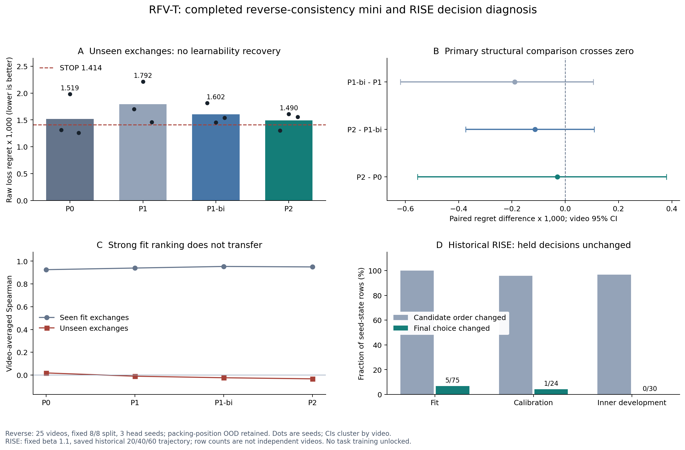

# RFV-T：反向一致性、RISE决策与D/S诊断进展

2026-09-15。本轮完成了新实现、真实GPU重放、6个head拟合、旧RISE决策级导出及独立统计审核。**反向一致性没有解决当前407D局部交换预测器的泛化；历史RISE的无收益对应于held最终选择没有变化。** 这些是具体诊断家族的结论，不是正式全轴T/S/D模型不可能成立的证明。

## 已冻结实现与实际执行

|来源|实际内容|
|---|---|
|b644d870d1845abbc1e4fd5ab7780f29ff96a53a|已完成的R1：18个同bank/同预算head；LEARNABILITY_FAIL保持|
|800bcd10a66c69d0d57142ac02389adbc45d2975|真实反向合同与RISE选择导出；mini在训练前退出|
|4aa1ca242c37b3f7e2aa727b05419628a74e4e90|复用冻结统计的修复版；实际完成P1/P2各3seed、每个2000updates|
|72459727f61454194f0d84865f31a16ed4e10448|独立固定D/S raw40路由和梯度诊断；不修改405课程|

新增模块是 h65/rfv/reverse.py、gradients.py，CLI为 tools/rfv_reverse_contract.py、rfv_reverse_mini.py、rfv_rise_choices.py、rfv_ds_diagnostic.py。编码执行、D/S算子、Cross与readout复用原内核。

Reverse输入不是机械交换两个名字：先构造真实S′=S−i+j，再重建反向角色、gap、support mean。反向membership为(1,0)，有效K不含padding。P1正反分别Huber；P1-bi仅复用P1同一raw checkpoint作差分读出；P2直接监督差分输出。保持407→128→64→2、原fit8统计、同数据顺序、同AdamW、三seed与2000steps，未叠加R1 JS或新增输入。

技术测试在4090/A100通过。初版损失测试把不同FP32 reduction顺序要求逐位相等，已用严格浮点容差替代；数学损失未改。800版mini另被CPU重算统计的torch.equal误拒，在任何head更新前退出；独立核对最大input_mean差仅8.94e−8。4aa直接复用并核对原CUDA计算的冻结buffers，没有重估归一化、改标签或追加训练。

## 真实反向合同通过，但不等于可学性通过

3个原fit状态（含短窗），6对交换，24次独立full forward：

- 同状态重放误差、原缓存标签误差、正反cls/loc收益残差全部0。
- 原407复现误差0；反向407最大误差5.96046448e−8；经过冻结normalization后的最大误差5.66393282e−7。
- 支持集往返与容量保持，loss normalizer固定。

交叉审核发现初版阈值随本次replay误差放宽，不能仅凭其自动PASS证明稳定。此次原始数字全部为0，已按独立固定界重新确认；后续工具改为原bank误差界并显式限制replay。本轮没有重复干净的24次GPU重放。

## Reverse Mini：STRUCTURE_SIGNAL_FAIL

评价是原25视频的8fit/8held；200个独立正向fit标签，反向监督不是新增独立样本。fit200全部属于tubelet局部位置5，held200为位置1/2，保留执行位置族外推限制。没有读取正式outer20或再次读取inner10。

|读出|held regret↓|held Spearman|held NDCG|fit Spearman|
|---|---:|---:|---:|---:|
|P0 原回归|0.001519199|0.01841|0.35395|0.92540|
|P1 双向监督/正向读出|0.001792271|−0.01016|0.32257|0.93968|
|P1-bi 同P1权重/差分读出|0.001602415|−0.02381|0.30276|0.95365|
|P2 直接差分监督|0.001489609|−0.03333|0.29633|0.94952|
|STOP|0.001413537|—|—|—|
|随机合法交换|0.001535185|—|—|—|

主比较P2−P1-bi regret为−0.000112806，10k视频配对95% CI [−0.000373990,+0.000108307]。三seed差分别−0.000511961、+0.000158828、+0.000014714；方向不稳定。P2仍未优于STOP。P2−P0 NDCG为−0.0576263，CI [−0.118795,−0.0054698]，这是明确不利的辅助结果。

P2在25视频×3seed的75次最终选择中全部执行，其中39次收益为负，即52%；分母不是600个候选。P0/P1/P1-bi的条件负率是排除STOP后的video/seed macro统计，不能一概改称pooled计数比例。

P2在calibration上regret0.003119858、平均选择收益为正，是描述性信号；cal每state16候选，而held为8候选且执行位置族不同，不能改用该点反选主模型或翻转已登记gate。反向输入达到−65.1至−70.2个原scale，但梯度/输出有限、fit排序强；因此不能把本轮科学FAIL改称数值训练故障。也不能据此唯一断定packing或尺度就是失败原因。

P1-bi/P2需反向构造和两次head forward；同K不代表全系统同成本。结果的cost.json保存了实际head参数量和线性MAC数。

## RISE：排序改变，最终决策未改变

复用真实历史20→40训练轨迹、current/累计trueEMA，固定s40输入与候选，以真实θ60收益评价；β=1.1保持旧cal选择，零新拟合、零新CF、零β重选。完整129条seed-state候选分数已导出并独立复算。

|范围|seed-state行数|候选排序改变|最终选择改变|STOP改变|
|---|---:|---:|---:|---:|
|fit|75|75|5|0|
|calibration|24|23|1|0|
|原inner development|30|29|0|0|

held的30行来自10视频×3seed；不是30个独立视频。17行满足2×最大绝对外推位移小于Post top2 margin这个充分不变条件，其余13行也没有实际换选择。候选排序改变并不保证top1/STOP改变。旧六项逐video指标全部零误差复现，独立导出公式/选择ID/runner-up/margin亦零误差。

因此本次已经解释Future=Post regret的直接决策原因。不能从中推出更大β会有效，不增β扫点；B0仍是历史回顾诊断，forecast FAIL和FVD未解锁保持。

## D/S与Atlas

四条405旧课程继续。新回收epoch40完整mAP：D-V64.26005572%、D-U64.33413122%，差−0.07407550pp；S-V64.06156949%、S-U64.24589687%，差−0.18432738pp。它们是中途组件消融，epoch80仍primary，未用test选择新配置。

真实train.jsonl显示四线约95.8–96.2%更新触发norm1全局裁剪，median约2.44–2.46。这个普遍现象不能单独归因于Value。固定raw40诊断比较同模型Value/Uniform路由，以及同一task/feature梯度加上/去掉detached Value辅助后的clip系数；不执行optimizer.step。当前运行/结束回执以evidence/ds_diagnostic和资源记录为准。

Atlas owner已完成原S收尾及另行授权的interaction_v1_s：211视频/792窗，四冻结背景的mAP交互−0.023734pp，CI [−0.103427,+0.132906]，INTERACTION_GATE=INCONCLUSIVE。有条件选择代价的刻画，不证明联合规划必要性或可加性；publication bank不回流RFV训练。B暂停，无新Atlas科学分支。

## 下一步与正式模型的区别

本轮不追加loss/容量/β矩阵，不把cal点选成成功。旧局部T-V/G/F/GF仍按自身gate保持未解锁；D/S旧课程保留至endpoint，Raw不扩6400/长训。

正式模型设计另成一线：BMCR全轴rate→S0→conditional→整体exact-K支持；Standard768候选，K384只是第一预算点；S/D逐层全合法token重轻分配及可学习跨时间/层预算，Raw区域获取另有观测成本合同。它需要自己的完整技术、任务梯度、matched训练与成本证据，不能被旧4-swap头的FAIL自动否决。目前是设计讨论/待实现候选，未宣称已部署。实施与设计owner往返意见见FORMAL_MODEL_SCOPE.zh.md。

独立审阅覆盖原执行、归一化误拒、逐候选RISE复算及Reverse所有seed/video聚合和15组bootstrap，数值一致；原FAIL和全部source保留。

