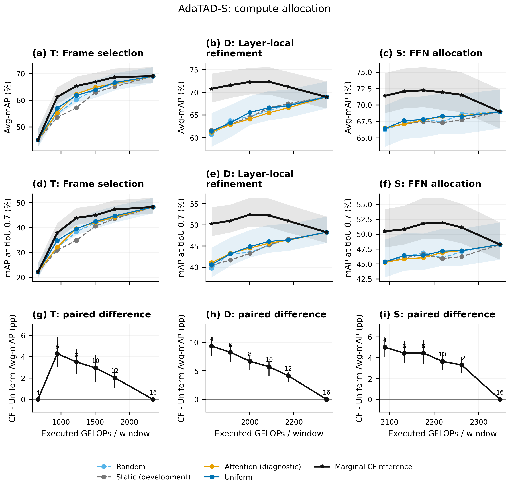
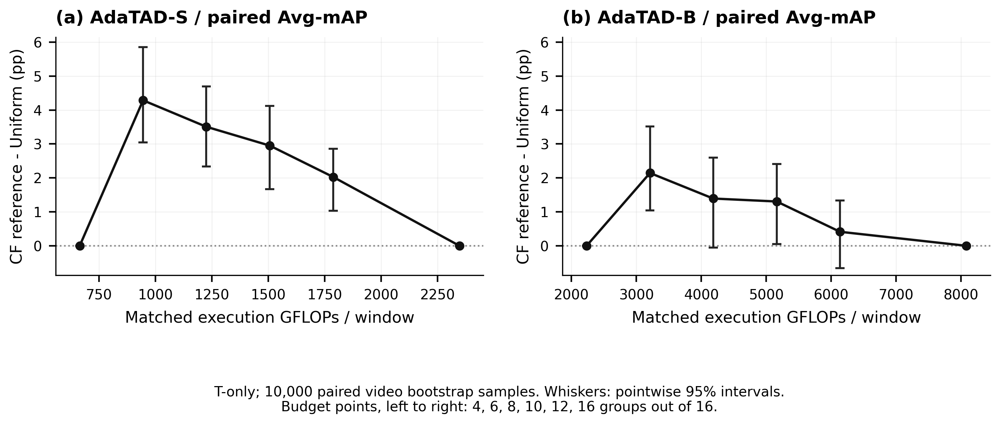
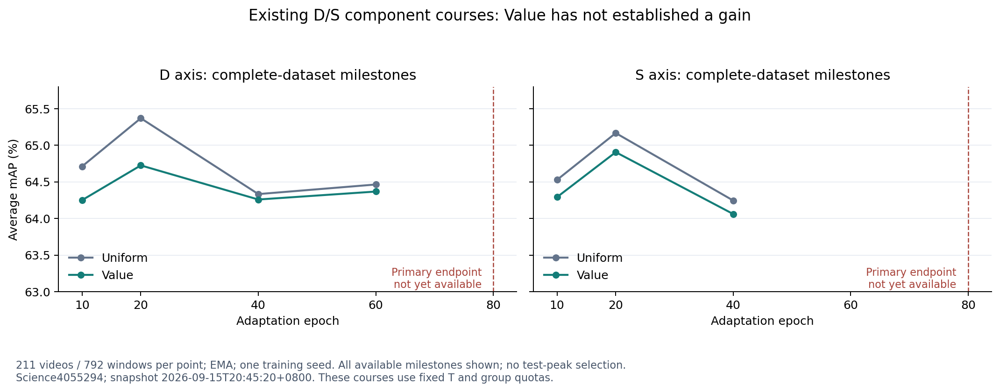
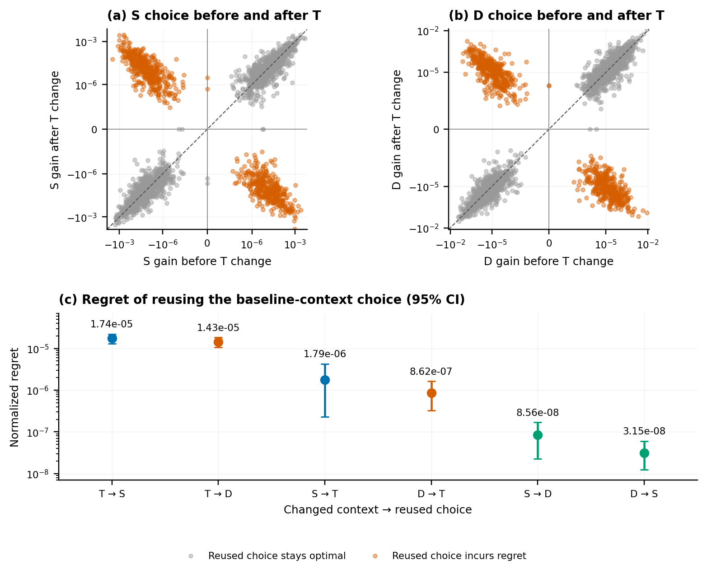

# 研究可视化图集

图中的实测点均来自已有模型/统计记录。本次不补画尚无结果的Global、Graph/FVD或Raw正式模型性能点。Atlas原图保留其完成的PDF视觉QA；RFV和课程图只读取已保存指标。

## 可直接下载的完整图集

|图集|PDF|含义|
|---|---|---|
|Atlas-S 6主图+2附录|[8页PDF](atlas/output/pdf_s/local_choice_revision/publication_atlas_with_appendices.pdf)|单点、有限预算、proxy与恢复证据|
|跨轴条件价值|[6页PDF](atlas/output/interaction_v1_s/interaction_atlas.pdf)|5主图+1探索附录；交互结论INCONCLUSIVE|
|旧轴内交互|[2页PDF](atlas/output/interaction_within_s/interaction_atlas.pdf)|同轴组合分析；不与跨轴混称|
|Reverse / RISE|[PDF](../rfv_sprint_20260915/figures_reverse/rfv_reverse_rise_evidence.pdf)|局部学习失败及最终选择不变|
|旧D/S完整课程|[PDF](figures/ds_course_trajectory.pdf)|全部当前可用milestone，80 endpoint尚待|

所有单图PNG/SVG/PDF与数值表：[Release下载](https://github.com/yuzbo/BMCR-T-AdaTAD/releases/tag/wtr-rfv-evidence-20260915)。正式模型的目标结构图在[Method设计](METHOD_AND_IMPLEMENTATION.zh.md#3-tbmcr机制的全轴条件分配)，明确属于设计规格。

## 有限预算机会，不是已学会分配

CF包含GT及额外模型查询；横轴是所选执行成本，查询成本另见同目录compute_cost_ledger。T/D/S的分组/背景不同，不以增量大小给三轴做直接横向排名。

S在所测中间T预算上稳定正；B部分预算CI跨0。这不是新learned router或全局子集oracle。

## 已见拟合与未见泛化

Reverse为25视频、固定8/8、3head seed，保留packing位置族差异；点是seed，区间为video-cluster CI。RISE的计数是seed-state而非独立视频。两类诊断不能自动否决具有不同决策空间/训练信号的正式全局模型。

每点为211视频/792窗完整EMA评测，单seed。全部可用milestone均展示，不选test峰值；80端点尚未完成。原始数据在courses目录。

## 条件价值，不等于联合模型获益

这里沿用旧背景上的实际二选一决策，再在新背景计算损失；不是learned router成绩。跨轴AP interaction的CI仍跨0，不证明全局可加，也不证明Joint Planner必要。

## 全部单图索引

|组|单图|
|---|---|
|原S设置|[选择/执行示意](atlas/output/pdf_s/local_choice_revision/fig1_controlled_interventions.png)|
|原S局部效应|[任务收益分布](atlas/output/pdf_s/local_choice_revision/fig2_task_necessity.png)、[同轴联合](atlas/output/pdf_s/local_choice_revision/fig2_joint_interventions.png)|
|原S预测与预算|[Proxy排序](atlas/output/pdf_s/local_choice_revision/fig3_proxy_value_ranking.png)、[T/D/S分配](atlas/output/pdf_s/local_choice_revision/fig4_allocation_s.png)|
|原S恢复|[原轴恢复](atlas/output/pdf_s/local_choice_revision/fig5_original_axis_recovery.png)|
|原S附录|[原始正负号](atlas/output/pdf_s/local_choice_revision/appendix_raw_signs.png)、[TAD条件](atlas/output/pdf_s/local_choice_revision/appendix_tad_conditions.png)|
|T完整S/B|[预算曲线](atlas/output/temporal/temporal_budget_curves.png)、[配对差](atlas/output/temporal/temporal_paired_difference.png)|
|轴内|[可加残差](atlas/output/interaction_within_s/within_axis_additivity.png)、[分布](atlas/output/interaction_within_s/within_axis_distribution.png)|
|跨轴|[条件收益](atlas/output/interaction_v1_s/conditional_value_interaction.png)、[交互矩阵](atlas/output/interaction_v1_s/interaction_matrix.png)、[选择regret](atlas/output/interaction_v1_s/conditional_choice_regret.png)|
|跨轴背景与案例|[T×S背景](atlas/output/interaction_v1_s/temporal_spatial_context.png)、[实际案例](atlas/output/interaction_v1_s/interaction_cases.png)、[探索分层](atlas/output/interaction_v1_s/appendix_interaction_strata.png)|

精确数值：[原S表](atlas/output/pdf_s/local_choice_revision/numeric_tables.md)、[跨轴表](atlas/output/interaction_v1_s/numeric_tables.md)、[T表](atlas/output/temporal/report.md)。不以同一图中的边际区间重叠替代配对检验，不把epsilon=0时的非零比例叫显著比例。
