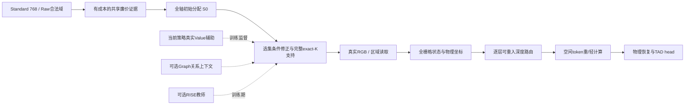

# 面向论文的 WTR：全域计算分配设计与实现状态

本文件是正式模型规格和代码差距说明，**不是已完成模型的性能声明**。当前可以写入论文的是经过注明身份的设计、实际实现和实验事实；不能把待实现部分写成已部署算法。已测结果在[进度与发现](STATUS_AND_FINDINGS.zh.md)，原始设计往返在[设计稿](design/FORMAL_MODEL_DESIGN.zh.md)和[owner意见](design/OWNER_DISCUSSION.zh.md)。

## 1. 论文方法与诊断工具各自回答什么

正式方法的目标是在预算下从可用视频证据中学习完整的时间、空间和计算路径分配，使最终TAD精度、神经计算与真实运行成本形成可验证改进。

诊断线问的是：在冻结的模型与状态上，改变某个选择是否有收益、输入能否预测该收益、收益是否随条件或checkpoint改变。这些工具可以进入实验、分析或附录，但不应规定最终方法只能在Uniform附近交换4帧。

|层级|当前对象|可写的论述|
|---|---|---|
|路线/机制验证|Atlas、Raw mini、T-local、407D R1/Reverse、离线G1/历史RISE、固定D/S诊断|限定条件下的机会、可学习性、误差、交互与负结果|
|完整训练的组件消融|旧D-V/U、S-V/U 80轮课程；历史BMCR/H65课程|对应实际执行域、初始化和监督的完整TAD实验|
|正式论文候选|Global-Task、Global-Task+Value、开放空间/深度分配、全轴Graph/RISE及Raw获取|设计和待实现方法；以自身技术/完整任务证据验证|
|已证明最终模型|目前没有|不能提前写“完整WTR已有效”“Graph/RISE是必要模块”|

旧局部FAIL保持。它不否决决策空间和学习路径不同的新Global方法；新方法成功也不能反过来抹去旧负结果。

## 2. 正式问题与“自由”的准确含义

给定一个先确定的物理episode，Standard的合法时间候选为768个位置；Raw则是episode内合法原始帧ID/物理时刻域。首先区分候选身份与内容观测：允许任意合法位置被提议，不等于零成本看到了它的RGB。

时间选择为

$$S_T=\pi_T(C,\tau,B,h),\qquad S_T\subseteq\mathcal C_{\rm valid},\quad |S_T|=K_{\rm valid}.$$

K384是第一个预算点，不是固定的384个身份，也不是最终模型唯一预算。完整窗可一次生成与Uniform差异远超过4帧的支持集；短窗按真实有效观察数和显式padding处理。没有默认的Uniform邻域、16-cell交换域或max-gap限制。

空间/深度计算在已取得观察形成的全栅格状态上定义。令D层mask决定哪些位置执行昂贵attention/refinement，S层mask决定哪些位置执行昂贵FFN。首版可以复用现有三分支：

1. 轻attention + 轻FFN；
2. 重attention + 轻FFN；
3. 重attention + 重FFN。

因此首版保持S⊆D是执行定义，而非理论最优性定理。D允许后续层重入。正式目标允许计算份额跨native时间、pack和层变化；当前每组固定份额只是旧消融或首技术版边界。

## 3. T：BMCR机制的全轴条件分配

下图是**正式候选的目标结构**；各模块的已实现/待实现状态见第11节，不表示整图已经训练。

正式T的第一版使用既有成熟机制，而非扩大swap次数：

**全768轴cheap evidence → 全轴rate → exact-K初始S0 → 选集条件上下文 → 全轴分配场修正 → 重新生成完整S1 → 真实RGB gather。**

对每个时间位置，policy读取当前cheap特征、物理时间、拟议选集的覆盖/替代信息、共享上下文及预算。它输出的是条件policy logit，不能自动称为校准后的真实边际收益。

校准保留率可写为

$$r_t=\sigma((u_t-\eta)/\tau),\qquad \sum_{t\in\mathcal C_{\rm valid}}r_t=K.$$

当前systematic积分采样保留平滑与coverage floor的归纳偏置。它解除4-swap邻域限制，但不精确穷举全部组合。若后续比较global top-K，应保持同scorer、输入和训练，只改变采样算子。

### 已有代码

- [FormalH65.route](../../h65/full/model.py#L45)：rate→S0→condition→整轴重采样。
- [FormalScout.condition](../../h65/full/scout.py#L63)：成员、partner、选集均值、gap、actionness和预算上下文。16-cell限制的是当前partner特征，不是全局采样输出。
- [sample_rates](../../h65/transport.py#L52)：容量校准、唯一有序hard选择、短窗有效性。
- [NativeEncoder.select/prepare](../../h65/paper/encoder.py#L73)：Paper中已有BMCR分支与transport入口。

### 尚需实现和接通

当前variant来自资源描述，旧D/S课程的selector=uniform且train_scout=false。新正式recipe需显式选择Global/BMCR、开启policy/Scout任务学习并关闭额外局部refiner；不能通过修改共享resources让旧课程行为漂移。

原FormalH65把GT映射到压缩rank；新方法应继承采样机制，同时保持Paper当前物理时间Cross及原轴readout。不能把整个旧detector直接覆盖过来。

## 4. 任务梯度：T已有桥，S/D尚未闭合

T的[gather_with_transport](../../h65/transport.py#L105)前向是真实hard RGB gather。训练时通过continuous坐标和detached邻居RGB slope传代理梯度；bridge_weight=.25不是采样温度。整数indices本身不可微，transport不是离散目标的精确梯度。

当前D/S在[engine.value_score](../../h65/paper/engine.py#L116)中no_grad求分数，再离散排序；[operator_training](../../h65/paper/operator_training.py#L70)用detach的当前状态与真实重执行收益训练router。只有参数requires_grad或存在TAD loss，并不表示硬mask已获得任务梯度。

首个正式S/D技术候选是：训练期计算明确用于代理梯度的重/轻分支，hard mask决定前向，连续替代/straight-through估计训练policy；推理只执行实际选择路径。它有偏，且训练双分支开销必须单列。必须证明同一个hard mask下训练前向与compact执行一致，以及task梯度确实抵达policy。

另一候选是hard预算随机采样+score-function任务优势和state baseline。它可避免为代理梯度计算全部未选heavy，但有方差及随机训练/确定推理差异。有序抽样轨迹概率与无序子集概率不同，不能把逐项概率乘积直接称为集合概率。

**两条方案尚未有实验优劣结论，也尚未作为正式S/D模型实现。** 首版只选一条闭合，不因设计讨论自动扩矩阵。

## 5. S：空间token集合与Raw ROI获取分开

当前代码已经对合法token整体打分，不是部署时只移动一个token。限制来自[ff_natives_quota](../../h65/paper/operator_value.py#L31)：每个pack的heavy FFN预算先按admitted数量分给8个native时间，再分别选择空间token。

正式Core应保留全栅格轻状态，使用当前token、物理时间/空间位置、邻域/全局上下文、已做计算与剩余预算，为整个窗口合法token分配重计算。mask可以形成多个不规则空间区域。

跨时间/pack自由分配需要新增：

- 窗口级或分层预算分配与准确整数投影；
- 将分配结果回填各pack，支持实际heavy长度不同的compact执行；
- 预算、有效性、表示恢复和实际执行成本闭合；
- 与原固定native份额控制、与学习信号改变分开消融。

这首先节省的是patchify之后的昂贵计算。**它不等于原RGB裁剪框选择，也不证明省掉整帧解码、空间stem或patch embedding。**

## 6. D：可重入的计算轨迹

现有WTR固定零基层[4,6,8,10]，每pack精确quota，fullKV和全栅格TIA保留。它是token级重/轻路径选择，后层可重新进入heavy；不是永久early-exit。

正式D应基于到当前层为止的可用状态、重计算历史、距上次heavy的层数、时间/空间上下文及剩余预算分配。可先在已有调制层闭合技术，再开放支持的中间层和跨层预算。固定层不应成为最终方法定义。

有效计算深度应报告每个位置的实际heavy次数和层分布；仅“最后heavy层号”不足以表征轨迹。fullKV投影、共享TIA、light路径仍计费，不能把selected-Q当作全部attention计算消失。如果以后研究单调early-exit，则需另行规定永久退出后的状态、传播与恢复。

## 7. Policy与真实Value分工

Policy负责可部署的完整分配；Value估计某个合法局部或成组改变的真实任务后果。它们可以共享条件上下文，但不能强行把任意条件交换收益表示成两个unary分数之差。

对当前策略状态上的改变δ，监督目标保持

$$g_\delta=[L_{\rm cls}(s)-L_{\rm cls}(s^\delta),\,L_{\rm loc}(s)-L_{\rm loc}(s^\delta)].$$

Value输入应具有axis-specific改变描述、cheap关系上下文、当前支持、执行历史、层/预算条件。GT只进入标签和损失，不进入部署predictor输入。CF应来自当前checkpoint/当前策略的重新执行；Atlas冻结publication标签不能冒充当前监督。

正式训练先区分

$$L_{\rm task}+ \lambda_s L_{\rm Scout}+\lambda_r L_{\rm recovery}$$

与增加actual-Value辅助的同policy对照。只有后者的独立增量成立，才能将论文收益归因于Value grounding。若只有任务驱动分配有效，方法应按task-aware adaptive computation表述。

当前407D R1/Reverse只是一个已完整测过的局部预测器，不是最终Value表示的固定上限，也不是所有policy学习的唯一来源。

## 8. Graph和RISE：有明确作用位置的可选组件

Graph在正式版本中服务全轴分配场或空间/深度状态的关系上下文：候选互补/覆盖、缺口和远近关系。应与同输入、参数/训练匹配的无图控制比较。旧G1点估计不稳定不证明所有Graph无用，也不能因换作用位置就宣称新Graph有效。

RISE作用于完整分配函数。snapshot应包含实际影响logit的conditioner、Graph、head及normalization。所有函数在共同原始输入/已观察证据、同候选身份、同预算与明确支持上下文上评价，才比较logit方向。外推

$$z_F=z_P+(\beta-1)(z_P-z_A)$$

后经过同一预算校准形成teacher。保留β=1/Post蒸馏和相同额外优化控制。全轴保留率蒸馏不是完整无序K子集分布蒸馏。新policy的future预测与完整task收益应独立验证，不能沿用历史局部B0的门作为新家族的一票否决或正证据。

最终Base/Graph/Future/Graph+Future四格只在其自身单项证据支持时形成；交互或冗余由实际结果决定。

## 9. Raw：自由候选域与有成本的观测

现有Raw-v1有Episode、共同192-preview、bounded proposal、arbitrary合法frame-ID读取、Tubelet元数据和恢复bridge。R+为Official池加固定offset候选，不是完整原视频自由获取策略。未preview位置的插值hidden不是该帧真实观察。

正式Raw可用粗到细时间提议或物理时间查询分配场，让episode内任意合法原始帧有被提出机会；每轮仍需要有限计算和实际读取预算。

Raw区域获取还需新增保留空间图的廉价预览、区域/patch获取策略、空间变换到公共物理坐标的映射，以及相应训练通路。当前时间池化hidden不满足这项要求。

应分别记神经FLOPs、实际返回/内部解码帧与像素、缓存命中、读取/缩放/传输时间、GPU延迟和峰值内存。不能把异单位简单相加或把FLOPs下降直接换算为端到端提速。Standard的RGB-neighbour transport在Raw中如需新读邻帧，必须计费或更换估计器。

## 10. 实现顺序与自身准入

|阶段|最小交付|证明什么|
|---|---|---|
|Global-T技术版|recipe级BMCR全轴选择、Scout/task bridge、当前Cross/readout、完整视频与reload|真正接通目标执行与优化路径|
|正式T对照|Uniform384、Global-Task、同policy的Global-Task+Value；同初始化/训练/预算|全局任务学习及Value的独立贡献|
|S与D|分别开放分配域，明确任务梯度估计，和固定份额控制比较|各轴的实际任务/成本增量|
|联合Core|共同适配的TSD，与最强单项/组合比较|联合是否值得，不强凑三轴|
|Graph/RISE|自身作用位置的matched增强与控制|关系/未来教师的必要增量|
|Raw时间/空间获取|共同preview控制、实际域区分、读取计费和matched retrain|额外输入自由度是否有实用价值|

Formal技术门检验有效容量、物理映射、hard执行、实际policy梯度、完整视频/重载；它不要求旧8/8头先成功。任务门使用epoch80端点、完整AP和成本/延迟；官方test不用来选checkpoint/超参。数据划分应保留各线的实际暴露记录：RFV mini的inner来自fit域，Raw历史mini已读其4-video router-holdout子集，不能笼统宣称所有研究从未接触同一20视频。

## 11. 当前实现差距总表

|能力|当前状态|不能冒称的能力|
|---|---|---|
|BMCR全轴采样和transport primitives|已有真实代码|新Global正式recipe已训练|
|物理时间Cross/原轴readout|已实际运行|任意新Raw/ROI映射自动正确|
|当前D/S compact重轻执行|已完整课程运行|全窗口/全层预算自由度或直接task路由梯度已实现|
|Raw reader与bounded候选|技术mini通过|自由Raw区域获取和端到端省时已成立|
|R1/Reverse/G1/历史RISE工具|已实现并保留真实正负结果|它们就是最终Method|
|正式Global/TSD/Graph/RISE|设计与待实现|最终论文模型已经验证成功|

研究主动推进仍暂停；本次工作是证据与设计发布，没有启动新的Global、S/D变体或Raw训练。
